## 介绍和安装

ClickHouse是俄罗斯的Yandex于2016年开源的**列式存储数据库**（DBMS），使用C++语言编写，主要用于**在线分析处理查询**（OLAP），能够使用SQL查询实时生成分析数据报告。

- OLAP（On-Line Analytical Processing）翻译为联机分析处理，专注于分析处理，从对数据库操作来看，OLAP是对数据的查询；
- OLTP（on-line transaction processing）翻译为联机事务处理，专注于事务处理，从对数据库操作来看，OLTP主要是对数据的增删改。

### 特点

1. **列式存储**

   以下面的表为例：

   <center>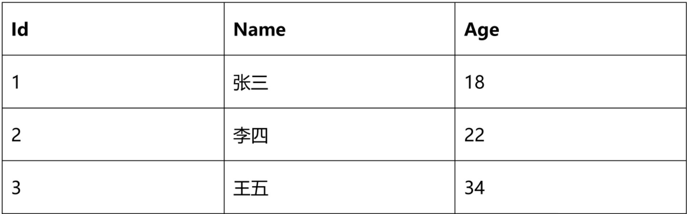</center>

   **1）采用行式存储时，数据在磁盘上的组织结构为**：

   <center>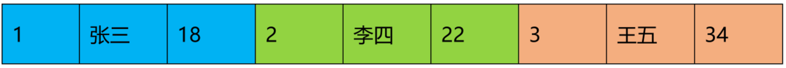</center>

   好处是想查某个人所有的属性时，可以通过一次磁盘查找加顺序读取就可以。但是当想查所有人的年龄时，需要不停的查找，或者全表扫描才行，遍历的很多数据都是不需要的。

   **2）采用列式存储时，数据在磁盘上的组织结构为**：

   <center>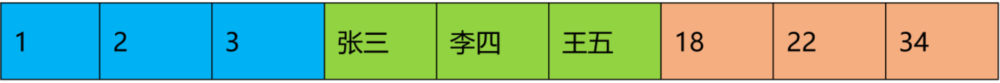</center>

   这时想查所有人的年龄只需把年龄那一列拿出来就可以了。

   **3）列式存储的好处**：

   - 对于列的聚合、计数、求和等统计操作原因优于行式存储；
   - 由于某一列的数据类型都是相同的，针对于数据存储更容易进行数据压缩，每一列选择更优的数据压缩算法，大大提高了数据的压缩比重；
   - 由于数据压缩比更好，一方面节省了磁盘空间，另一方面对于cache也有了更大的发挥空间
     

2. **DBMS的功能**：几乎覆盖了标准SQL的大部分语法，包括DDL和DML，以及配套的各种函数，用户管理及权限管理，数据的备份与恢复；

3. **多样化引擎**：ClickHouse和MySQL类似，把表级的存储引擎插件化，根据表的不同需求可以设定不同的存储引擎。目前包括合并树、日志、接口和其他四大类20多种引擎；

4. **高吞吐写入能力**：ClickHouse采用类LSM Tree的结构，数据写入后定期在后台Compaction。通过类LSM tree的结构，ClickHouse在数据导入时全部是顺序append写，写入后数据段不可更改，在后台compaction时也是多个段merge sort后顺序写回磁盘。顺序写的特性，充分利用了磁盘的吞吐能力，即便在HDD上也有着优异的写入性能。

   官方公开benchmark测试显示能够达到50MB-200MB/s的写入吞吐能力，按照每行100Byte估算，大约相当于50W-200W条/s的写入速度

5. **数据分区与线程级并行**

   ClickHouse将数据划分为多个partition，每个partition再进一步划分为多个index granularity（索引粒度），然后通过多个CPU核心分别处理其中的一部分来实现并行数据处理。在这种设计下，单条Query就能利用整机所有CPU。极致的并行处理能力，极大的降低了查询延时

   所以，ClickHouse即使对于大量数据的查询也能够化整为零平行处理。但是有一个弊端就是对于单条查询使用多cpu，就不利于同时并发多条查询。所以对于高qps的查询业务，ClickHouse并不是强项


### 安装

#### 准备工作

1. 确定防火墙处于关闭状态

2. CentOS取消打开文件数限制

   ```bash
   sudo vim /etc/security/limits.conf
   ```

   在末尾加入：
   ```bash
   * soft nofile 65536
   * hard nofile 65536
   * soft nproc 131072
   * hard nproc 131072
   ```

   1. 第一列是限制的用户和用户组
   2. soft软限制，hard硬限制
   3. nofile打开文件数，nproc用户进程数

   ```bash
   sudo vim /etc/security/limits.d/20-nproc.conf
   ```

   在末尾加入：

   ```bash
   * soft nofile 65536
   * hard nofile 65536
   * soft nproc 131072
   * hard nproc 131072
   ```

   退出当前用户，重启登录，`ulimit -a`查看打开文件数和用户进程数是否更改

   ```bash
   [root@aliyun ~]# ulimit -a
   core file size          (blocks, -c) 0
   data seg size           (kbytes, -d) unlimited
   scheduling priority             (-e) 0
   file size               (blocks, -f) unlimited
   pending signals                 (-i) 7284
   max locked memory       (kbytes, -l) 64
   max memory size         (kbytes, -m) unlimited
   open files                      (-n) 65536
   pipe size            (512 bytes, -p) 8
   POSIX message queues     (bytes, -q) 819200
   real-time priority              (-r) 0
   stack size              (kbytes, -s) 8192
   cpu time               (seconds, -t) unlimited
   max user processes              (-u) 131072
   virtual memory          (kbytes, -v) unlimited
   file locks                      (-x) unlimited
   ```

3. 安装依赖

   ```bash
   sudo yum install -y libtool
   sudo yum install -y *unixODBC*
   ```

4. CentOS取消SELINUX（不知道为什么我修改后，就没网了）

   ```bash
   vim /etc/selinux/config
   ```

   修改为：

   ```bash
   SELINUX=disabled
   ```

   修改完重启服务器


#### 单机安装

1. 下载安装包

   :point_right: [安装包下载](https://packages.clickhouse.com/deb/pool/stable/)

   需要以下四个rpm包：

   ```bash
   clickhouse-client-21.7.3.14-2.noarch.rpm
   clickhouse-common-static-21.7.3.14-2.x86_64.rpm
   clickhouse-common-static-dbg-21.7.3.14-2.x86_64.rpm
   clickhouse-server-21.7.3.14-2.noarch.rpm
   ```

   > **mac下要下载arm的，注意！！！**

   也可以通过wget下载：

   ```bash
   wget https://repo.yandex.ru/clickhouse/rpm/stable/x86_64/clickhouse-client-21.7.3.14-2.noarch.rpm
   wget https://repo.yandex.ru/clickhouse/rpm/stable/x86_64/clickhouse-common-static-21.7.3.14-2.x86_64.rpm
   wget https://repo.yandex.ru/clickhouse/rpm/stable/x86_64/clickhouse-common-static-dbg-21.7.3.14-2.x86_64.rpm
   wget https://repo.yandex.ru/clickhouse/rpm/stable/x86_64/clickhouse-server-21.7.3.14-2.noarch.rpm
   ```

   安装这4个rpm包：

   ```BASH
   sudo rpm -ivh *.rpm
   ```

2. 修改配置文件

   ```bash
   cd /etc/clickhouse-server/
   sudo chmod 777 config.xml 
   sudo vim config.xml 
   ```

   把`<listen_host>0.0.0.0</listen_host>`的注释打开，这样的话才能让ClickHouse被除本机之外的服务器访问。

   这个配置文件中，ClickHouse一些默认路径配置：

   - 数据文件路径：`<path>/var/lib/clickhouse/</path>`
   - 日志文件路径：`<log>/var/log/clickhouse-server/clickhouse-server.log</log>`

3. 启动Server

   ```bash
   sudo systemctl start clickhouse-server
   或者
   sudo clickhouse start
   ```

   查看启动状态：

   ```bash
   sudo systemctl status clickhouse-server
   或者
   sudo clickhouse status
   ```

4. 关闭开启自启

   ```bash
   sudo systemctl disable clickhouse-server
   ```

5. 使用client连接server

   ```bash
   clickhouse-client -m
   ```

​		<center>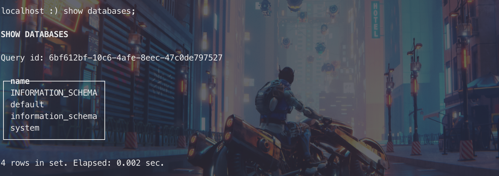</center>

在连接的过程中出现了两个错误：

1. 错误一：

   ```bash
   Code: 210. DB::NetException: Connection refused (localhost:9000). (NETWORK_ERROR)
   ```

   如果在配置文件中有`<listen_host>::</listen_host>`，就改成`<listen_host>0.0.0.0</listen_host>，因为::是IPv6的通配符，我部署clickhouse的机器不支持ipv6。`

2. 错误二：

   ```bash
   Code: 516. DB::Exception: Received from localhost:9000. DB::Exception: default: Authentication failed: password is incorrect or there is no user with such name. (AUTHENTICATION_FAILED)
   ```

   在命令中带上`--password`：

   ```bash
   clickhouse-client -m --password
   ```


## 数据类型

### 整形

固定长度的整型，包括有符号整型或无符号整型

整型范围$(2^n-1 \ \sim \  2^{n-1}-1)$：Int8、Int16、Int32、Int64

无符号整型范围$(0 \ \sim \ 2^n-1)$：UInt8、UInt16、UInt32、UInt64


### 浮点数

Float32、Float64

浮点数计算精度缺失问题：

```sql
select 1.0-0.9
```

```bash
┌──────minus(1., 0.9)─┐
│ 0.09999999999999998 │
└─────────────────────┘
```


### 布尔型

没有单独的类型来存储布尔值。可以使用UInt8类型，取值限制为0或1。


### Decimal型

Decimal32(s)相当于Decimal(9-s,s)

Decimal64(s)相当于Decimal(18-s,s)

Decimal128(s)相当于Decimal(38-s,s)


### 字符串
1. **String**：字符串可以任意长度的。它可以包含任意的字节集，包含空字节；
2. **FixedString(N)**：固定长度N的字符串，N必须是严格的正自然数。当服务端读取长度小于N的字符串时候，通过在字符串末尾添加空字节来达到N字节长度。当服务端读取长度大于N的字符串时候，将返回错误消息。


### 枚举类型

包括Enum8和Enum16类型。Enum保存**’string’=integer**的对应关系

- Enum8用’string’=Int8来描述
- Enum16用’string’=Int16来描述

创建一个带有一个枚举Enum8(‘hello’ = 1, ‘world’ = 2)类型的列：

```bash
create table t_enum(
x Enum8('hello' = 1,'world' = 2)
)engine = TinyLog;
```

这个x列只能存储类型定义中列出的值：‘hello’或’world’：

```sql
inser tinto t_enum values ('hello'),('hello'),('world'),('world');
```

如果尝试保存任何其他值，ClickHouse抛出异常：

```bash
insert into t_enum values('a');
```

<center>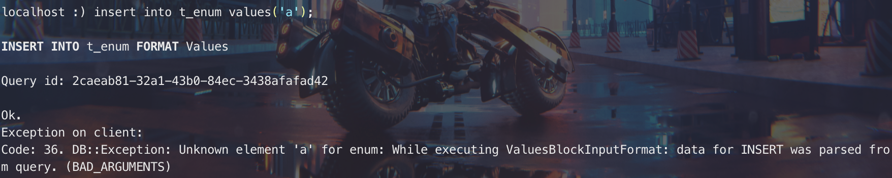</center>

如果需要看到对应行的数值，则必须将Enum值转换为整数类型：

```sql
select cast(x,'Int8') from t_enum;
```

<center>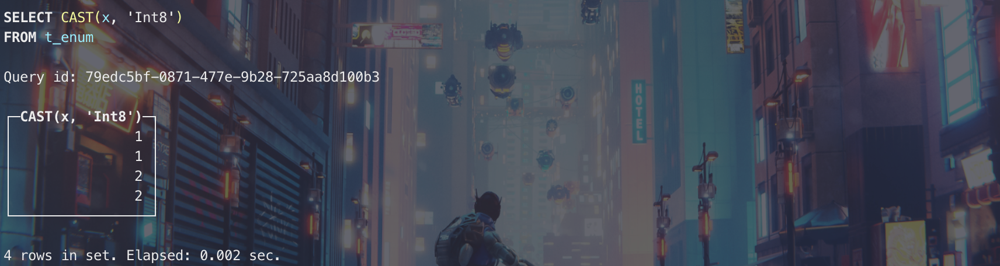</center>


### 时间类型
目前ClickHouse有三种时间类型：

- **Date**接受年-月-日的字符串，比如：2019-12-16；
- **Datetime**接受年-月-日 时:分:秒的字符串，比如2019-12-16 20:50:10；
- **Datetime64** 接受年-月-日 时:分:秒.亚秒的字符串，比如2019-12-16 20:50:10.66。

日期类型用两个字节存储，表示从1970-01-01到当前的日期值


### 数组

Array(T)：由T类型元素组成的数组

T可以是任意类型，包含数组类型。但不推荐使用多维数组，ClickHouse对多维数组的支持有限。例如，不能在MergeTree表中存储多维数组

创建数组方式：

1. **使用array函数**

   ```sql
   select array(1, 2) as x, toTypeName(x);
   ```

   <center>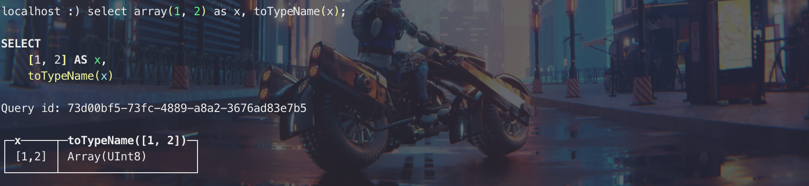</center>


2. **使用方括号**

   ```sql
   select [1, 2] as x, toTypeName(x);
   ```

   <center>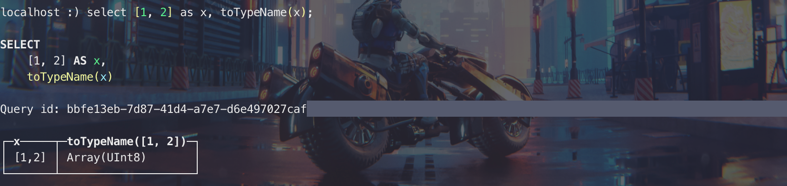</center>


## 数据库引擎

### 数据库引擎和表引擎

<center>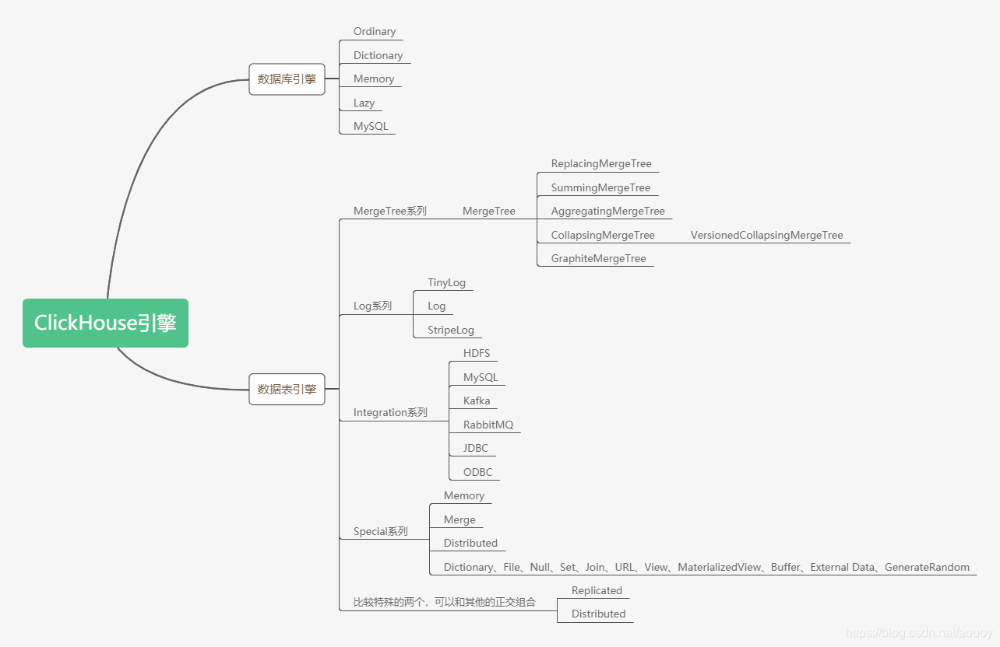</center>

- 数据库引擎默认是**Ordinary**，在这种数据库下面的表可以是任意类型引擎。
- 生产环境中常用的表引擎是**MergeTree**系列，也是官方主推的引擎。
- MergeTree是基础引擎，有主键索引、数据分区、数据副本、数据采样、删除和修改等功能，
- ReplacingMergeTree有了去重功能，
- SummingMergeTree有了汇总求和功能，
- AggregatingMergeTree有聚合功能，
- CollapsingMergeTree有折叠删除功能，
- VersionedCollapsingMergeTree有版本折叠功能，
- GraphiteMergeTree有压缩汇总功能。
- 在这些的基础上还可以叠加Replicated和Distributed。Integration系列用于集成外部的数据源，常用的有HADOOP，MySQL。


### MaterializeMySQL

#### 基本概述

MySQL 的用户群体很大，为了能够增强数据的实时性，很多解决方案会利用 binlog 将数据写入到 ClickHouse。为了能够监听 binlog 事件，我们需要用到类似 canal 这样的第三方中间件，这无疑增加了系统的复杂度。

ClickHouse 20.8.2.3 版本新增加了 MaterializeMySQL 的 database 引擎，**该 database 能映 射 到 MySQL 中 的 某 个 database ， 并 自 动 在 ClickHouse 中 创 建 对 应 的ReplacingMergeTree**。**ClickHouse 服务做为 MySQL 副本，读取 Binlog 并执行 DDL 和 DML 请求，实现了基于 MySQL Binlog 机制的业务数据库实时同步功能。**


#### 特点

- **MaterializeMySQL 同时支持全量和增量同步**，在 database 创建之初会全量同步MySQL 中的表和数据，**之后则会通过 binlog 进行增量同步**；

- MaterializeMySQL database 为其所创建的每张 ReplacingMergeTree 自动增加了\_sign 和 \_version 字段。

  其中，\_version 用作 ReplacingMergeTree 的 ver 版本参数，每当监听到 insert、update 和 delete 事件时，在 databse 内全局自增。而 \_sign 则用于标记是否被删除，取值 1 或者 -1。

- 目前 MaterializeMySQL 支持如下几种 binlog 事件:
  - MYSQL_WRITE_ROWS_EVENT：\_sign = 1，\_version ++；
  - MYSQL_DELETE_ROWS_EVENT：\_sign = -1，\_version ++；
  - MYSQL_UPDATE_ROWS_EVENT：新数据 \_sign = 1；
  - MYSQL_QUERY_EVENT: 支持 CREATE TABLE 、DROP TABLE 、RENAME TABLE 等。


#### 使用细则

1. DDL 查询

   MySQL DDL 查询被转换成相应的 ClickHouse DDL 查询（ALTER, CREATE, DROP, RENAME）。如果 ClickHouse 不能解析某些 DDL 查询，该查询将被忽略。

2. 数据复制

   MaterializeMySQL 不支持直接插入、删除和更新查询，而是将 DDL 语句进行相应转换：

   - MySQL INSERT 查询被转换为 INSERT with \_sign=1；
   - MySQL DELETE 查询被转换为 INSERT with \_sign=-1；
   - MySQL UPDATE 查询被转换成 INSERT with \_sign=1 和 INSERT with \_sign=-1。

3. SELECT 查询

   - 如果在 SELECT 查询中没有指定\_version，则使用 FINAL 修饰符，返回\_version 的最大值对应的数据，即最新版本的数据；
   - 如果在 SELECT 查询中没有指定\_sign，则默认使用 WHERE \_sign=1，即返回未删除状态（\_sign=1)的数据。

4. 索引转换

   - ClickHouse 数据库表会自动将 MySQL 主键和索引子句转换为ORDER BY 元组；
   - ClickHouse 只有一个物理顺序，由 ORDER BY 子句决定。如果需要创建新的物理顺序，请使用物化视图。


#### 案例实操

##### MySQL 开启 binlog 和 GTID 模式

确保 MySQL **开启了 binlog 功能**，且格式为 `ROW` 打开/etc/my.cnf,在[mysqld]下添加：

```sql
server-id=1
log-bin=mysql-bin
binlog_format=ROW
```

**开启 GTID 模式**，如果如果 clickhouse 使用的是 20.8 prestable 之后发布的版本，那么 MySQL 还需要配置开启 `GTID` 模式, 这种方式在 mysql 主从模式下可以`确保数据同步的一致性`(主从切换时)。

```sql
gtid-mode=on
enforce-gtid-consistency=1 # 设置为主从强一致性
log-slave-updates=1 # 记录日志
```

**GTID 是 MySQL 复制增强版**，从 MySQL 5.6 版本开始支持，目前已经是 MySQL 主流复制模式。它为每个 event 分配一个全局唯一 ID 和序号，我们可以不用关心 MySQL 集群主从拓扑结构，直接告知 MySQL 这个 GTID 即可。

重启 MySQL：

```bash
sudo systemctl restart mysqld
```


##### 准备 MySQL 表和数据

```sql
CREATE DATABASE testck;
CREATE TABLE `testck`.`t_organization` (
	`id` int(11) NOT NULL AUTO_INCREMENT,
	`code` int NOT NULL,
	`name` text DEFAULT NULL,
	`updatetime` datetime DEFAULT NULL,
	PRIMARY KEY (`id`),
	UNIQUE KEY (`code`)
) ENGINE=InnoDB;

INSERT INTO testck.t_organization (code,name,updatetime) VALUES(1000,'Realinsight',NOW());
INSERT INTO testck.t_organization (code,name,updatetime) VALUES(1001, 'Realindex',NOW());
INSERT INTO testck.t_organization (code,name,updatetime) VALUES(1002,'EDT',NOW());

CREATE TABLE `testck`.`t_user` (
	`id` int(11) NOT NULL AUTO_INCREMENT,
	`code` int,
	PRIMARY KEY (`id`)
) ENGINE=InnoDB;

INSERT INTO testck.t_user (code) VALUES(1);
```


##### 开启 ClickHouse 物化引擎

```sql
set allow_experimental_database_materialize_mysql=1;
```


##### 创建复制管道

ClickHouse 中创建MaterializeMySQL 数据库

```sql
CREATE DATABASE test_binlog ENGINE = MaterializeMySQL('hadoop1:3306','testck','root','000000');
```

其中 4 个参数分别是 MySQL 地址、databse、username 和 password。

查看 ClickHouse 的数据：

```sql
use test_binlog;
show tables;
select * from t_organization;
select * from t_user;
```


##### 修改数据

在 MySQL 中修改数据：

```
update t_organization set name = CONCAT(name,'-v1') where id = 1
```

查看 clickhouse 日志可以看到 binlog 监听事件，查询clickhouse：

```sql
select * from t_organization;
```


##### 删除数据

MySQL 删除数据：

```sql
DELETE FROM t_organization where id = 2;
```

ClicKHouse，日志有 DeleteRows 的 binlog 监听事件，查看数据：

```sql
select * from t_organization;
```

在刚才的查询中增加 _sign 和 _version 虚拟字段：

```sql
select *,_sign,_version from t_organization order by _sign desc,_version desc;
```

<center>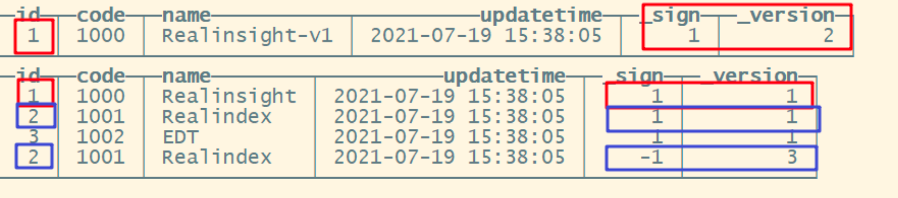</center>

在查询时，对于已经被删除的数据，\_sign=-1，ClickHouse 会自动重写 SQL，将 \_sign =1 的数据过滤掉;

对于修改的数据，则自动重写 SQL，为其增加 FINAL 修饰符。

```sql
select * from t_organization
等同于
select * from t_organization final where _sign = 1
```


##### 删除表

在 mysql 执行删除表：

```sql
drop table t_user;
```

此时在 clickhouse 处会同步删除对应表，如果查询会报错：

```sql
show tables;
select * from t_user;
DB::Exception: Table scene_mms.scene doesn't exist.. 
```

mysql 新建表，clickhouse 可以查询到：

```sql
CREATE TABLE `testck`.`t_user` (
`id` int(11) NOT NULL AUTO_INCREMENT,
`code` int,
PRIMARY KEY (`id`)
) ENGINE=InnoDB;

INSERT INTO testck.t_user (code) VALUES(1);

#ClickHouse 查询
show tables;
select * from t_user;
```


## 表引擎

### 表引擎的使用

表引擎决定了如何存储表的数据。包括：

- 数据的存储方式和位置，写到哪里以及从哪里读取数据；
- 支持哪些查询以及如何支持；
- 并发数据访问；
- 索引的使用（如果存在）；
- 是否可以执行多线程请求；
- 数据复制参数；
- 表引擎的使用方式就是必须显式在创建表时定义该表使用的引擎，以及引擎使用的相关参数。

> **引擎的名称大小写敏感。**


### TinyLog

**以列文件的形式保存在磁盘上**，**不支持索引，没有并发控制**。一般保存少量数据的小表，生产环境上作用有限。可以用于平时练习测试用。


### Memory
内存引擎：**数据以未压缩的原始形式直接保存在内存当中，服务器重启数据就会消失**。**读写操作不会相互阻塞，不支持索引**。简单查询下有非常非常高的性能表现（超过10G/s）。一般用到它的地方不多，除了用来测试，就是在需要非常高的性能，同时数据量又不太大（上限大概1亿行）的场景


### MergeTree(🌟)

ClickHouse中最强大的表引擎当属MergeTree（合并树）引擎及该系列（MergeTree）中的其他引擎，**支持索引和分区**，地位可以相当于innodb之于Mysql。

#### 基本sql

（1）建表语句：

```sql
CREATE TABLE [IF NOT EXISTS] [db.]table_name [ON CLUSTER cluster]
(
    name1 [type1] [DEFAULT|MATERIALIZED|ALIAS expr1] [TTL expr1],
    name2 [type2] [DEFAULT|MATERIALIZED|ALIAS expr2] [TTL expr2],
    ...
    INDEX index_name1 expr1 TYPE type1(...) GRANULARITY value1,
    INDEX index_name2 expr2 TYPE type2(...) GRANULARITY value2
) ENGINE = MergeTree()
ORDER BY expr
[PARTITION BY expr]
[PRIMARY KEY expr]
[SAMPLE BY expr]
[TTL expr [DELETE|TO DISK 'xxx'|TO VOLUME 'xxx'], ...]
[SETTINGS name=value, ...]
```

- **PARTITION BY**：分区键，用于指定数据以何种标准进行分区。分区键可以是单个列字段、元组形式的多个列字段、列表达式。如果不声明分区键，则ClickHouse会生成一个名为all的分区。合理使用数据分区，可以有效减少查询时数据文件的扫描范围。
- **ORDER BY** 决定了每个分区中数据的排序规则；主键必须是order by字段的前缀字段；在ReplactingmergeTree中，order by相同的被认为是重复的数据；在SummingMergeTree中作为聚合的维度列；
- **PRIMARY KEY** 决定了一级索引(primary.idx)，默认情况下，主键与排序键（ORDER BY）相同，所以通常使用ORDER BY代为指定主键。一般情况下，在单个数据片段内，数据与一级索引以相同的规则升序排序。与其他数据库不同，MergeTree主键允许存在重复数据；
- **SAMPLE BY**：抽样表达式，用于声明数据以何种标准进行采样。抽样表达式需要配合SAMPLE子查询使用；
- **SETTINGS**：**index_granularity**：索引粒度，默认值8192。也就是说，默认情况下每隔8192行数据才生成一条索引；
- **SETTINGS**：**index_granularity_bytes**：在19.11版本之前，ClickHouse只支持固定大小的索引间隔（index_granularity）。在新版本中增加了自适应间隔大小的特性，即根据每一批次写入数据的体量大小，动态划分间隔大小。而数据的体量大小，由index_granularity_bytes参数控制，默认10M；
- **SETTINGS：enable_mixed_granularity_parts**：设置是否开启自适应索引间隔的功能，默认开启。

例子：

```sql
create table t_order_mt(
    id UInt32,
    sku_id String,
    total_amount Decimal(16,2),
    create_time Datetime
) engine = MergeTree
partition by toYYYYMMDD(create_time)
primary key (id)
order by (id,sku_id);
```

（2）插入数据：

```sql
insert into t_order_mt values
(101,'sku_001',1000.00,'2020-06-01 12:00:00') ,
(102,'sku_002',2000.00,'2020-06-01 11:00:00'),
(102,'sku_004',2500.00,'2020-06-01 12:00:00'),
(102,'sku_002',2000.00,'2020-06-01 13:00:00'),
(102,'sku_002',12000.00,'2020-06-01 13:00:00'),
(102,'sku_002',600.00,'2020-06-02 12:00:00');
```

查询数据：

<center>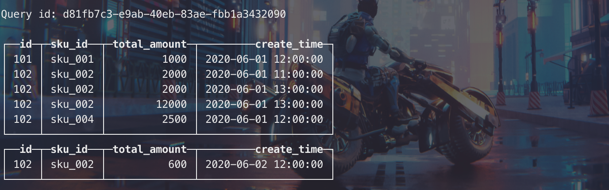</center>

1. 根据日期分区，2020-06-01、2020-06-02共两个分区；
2. 主键可重复；
3. 分区内根据id和sku_id排序。


#### 分区(可选)

分区的目的主要是**降低扫描的范围，优化查询速度**，**如果不填，只会使用一个分区**。分区后，面对涉及跨分区的查询统计，ClickHouse会**以分区为单位**并行处理。

##### 文件结构

在前面安装时，就介绍过，配置文件中表明了默认的数据存储位置是/var/lib/clickhouse，因此结构如下：

<center></center>

里面有两个文件夹很重要：**metadata**和**data**。

（1）metadata保存了数据库的元数据，每个库的每个表都会记录表结构信息：

<center>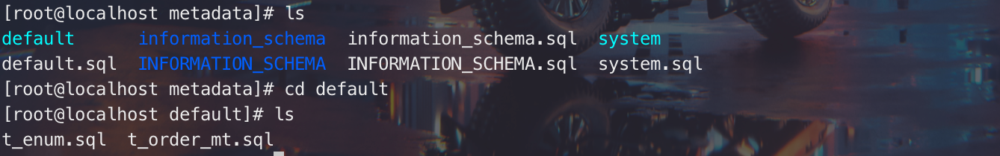</center>

```sql
ATTACH TABLE _ UUID 'c51df0c7-bae7-4abb-b8a8-d2a5523cdb26'
(
    `id` UInt32,
    `sku_id` String,
    `total_amount` Decimal(16, 2),
    `create_time` DateTime
)
ENGINE = MergeTree
PARTITION BY toYYYYMMDD(create_time)
PRIMARY KEY id
ORDER BY (id, sku_id)
SETTINGS index_granularity = 8192
```

基本上和建表语句差不多。

（2）data保存了每个库的表数据：

<center>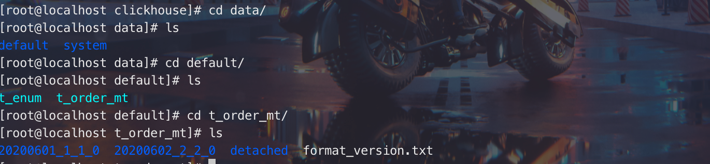</center>

20200601_1_1_0、20200602_2_2_0共两个分区目录。

分区目录命名格式：**PartitionId_MinBlockNum_MaxBlockNum_Level**，分表代表**分区值**、**最小分区块编号**、最大分区块编号、合**并层级**。

而每一个分区目录下都包含如下文件：

```bash
-rw-r-----. 1 clickhouse root 259 8月  29 03:02 checksums.txt
-rw-r-----. 1 clickhouse root 118 8月  29 03:02 columns.txt
-rw-r-----. 1 clickhouse root   1 8月  29 03:02 count.txt
-rw-r-----. 1 clickhouse root 189 8月  29 03:02 data.bin
-rw-r-----. 1 clickhouse root 144 8月  29 03:02 data.mrk3
-rw-r-----. 1 clickhouse root  10 8月  29 03:02 default_compression_codec.txt
-rw-r-----. 1 clickhouse root   8 8月  29 03:02 minmax_create_time.idx
-rw-r-----. 1 clickhouse root   4 8月  29 03:02 partition.dat
-rw-r-----. 1 clickhouse root   8 8月  29 03:02 primary.idx
```

- data.bin：数据文件；（其实每一个列都会有一个bin文件）
- data.mrk3：标记文件，标记文件在idx索引文件和bin数据文件之间起到了桥梁作用；（每一个列都会有一个mrk文件）
- count.txt：有几条数据；
- default_compression_codec.txt：默认压缩格式；
- columns.txt：列的信息；
- primary.idx：主键索引文件；
- partition.dat与minmax_[Column].idx：如果使用了分区键，则会额外生成这2个文件，均使用二进制存储。partition.dat保存当前分区下分区表达式最终生成的值；minmax索引用于记录当前分区下分区字段对应原始数据的最小值和最大值。以t_order_mt的20200601分区为例，partition.dat中的值为20200601，minmax索引中保存的值为2020-06-01 12:00:002020-06-01 13:00:00
  


##### 分区命名

**PartitionId**：数据分区规则由分区ID决定，分区ID由partition by分区键决定。根据分区键字段类型，ID生成规则可分为：

- 未定义分区键：没有定义partition by，默认生成一个目录名为all的数据分区，所有数据均存放在all目录下；
- 整型分区键：分区键为整型，直接用该整型值的字符串形式作为分区ID；
- 日期类分区键：分区键为日期类型，或者可以转换为日期类型；
- 其他类型分区键：String、Float类型等，通过128位的Hash算法取其Hash值作为分区ID。

<center>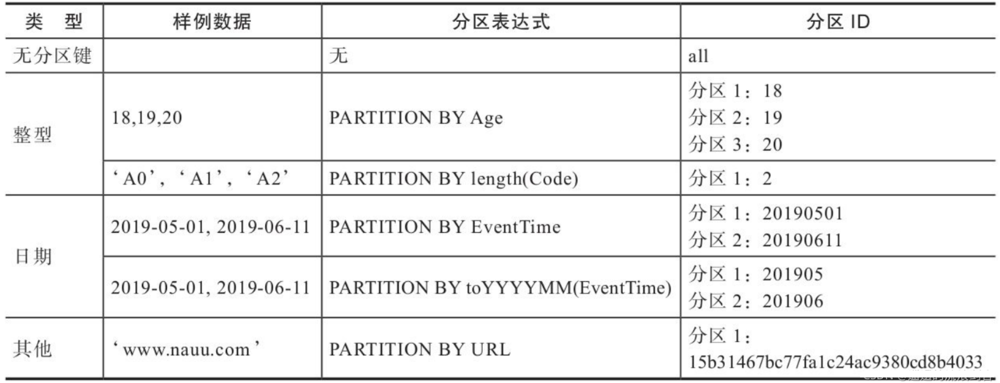</center>

**MinBlockNum**：最小分区块编号，自增类型，从1开始向上递增。每产生一个新的目录分区就向上递增一个数字；

**MaxBlockNum**：最大分区块编号，新创建的分区MinBlockNum等于MaxBlockNum的编号；

**Level**：合并的层级，被合并的次数。合并次数越多，层级值越大。对于每一个新创建的分区目录而言，其初始值均为0。以分区为单位，如果相同分区发生合并动作，则在相应分区内计数+1。


##### 分区合并

**任何一个批次的数据写入都会产生一个临时分区，也就是写入一个新的分区目录，不会纳入任何一个已有的分区**。**写入后的某个时刻（大概10-15分钟后），ClickHouse会自动执行合并操作（等不及也可以手动通过optimize执行），把临时分区的数据，合并到已有分区中，已经存在的旧分区目录并不会立即被删除，而是在之后的某个时刻通过后台任务被删除（默认8分钟）**。

- **MinBlockNum**：取同一分区内所有目录中最小的MinBlockNum值
- **MaxBlockNum**：取同一分区内所有目录中最大的MaxBlockNum值
- **Level**：取同一分区内最大Level值+1

合并过程：

<center>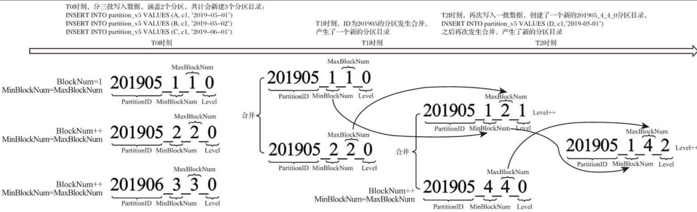</center>

手动合并：

```sql
optimize table xxxx final;
```

在如上的基础上，在插入数据：

```sql
insert into t_order_mt values
(101,'sku_001',1000.00,'2020-06-01 12:00:00') ,
(102,'sku_002',2000.00,'2020-06-01 11:00:00'),
(102,'sku_004',2500.00,'2020-06-01 12:00:00'),
(102,'sku_002',2000.00,'2020-06-01 13:00:00'),
(102,'sku_002',12000.00,'2020-06-01 13:00:00'),
(102,'sku_002',600.00,'2020-06-02 12:00:00');
```

查看数据并没有纳入任何分区，而是新产生了一个分区：

<center>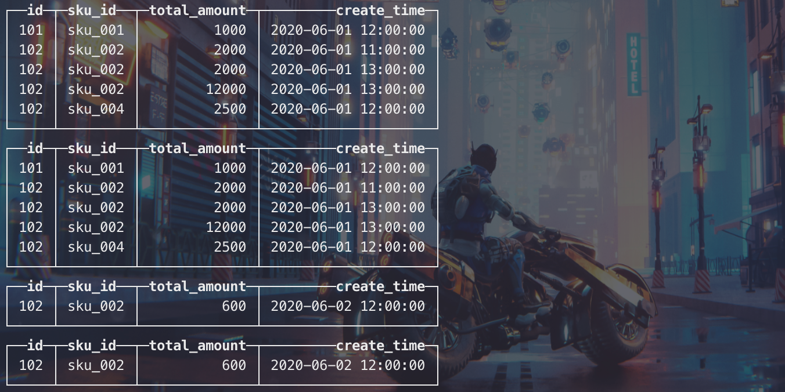</center>

在看数据文件：

<center></center>

也多加了两个分区文件。

手动optimize之后：

```sql
optimize table t_order_mt final;
```

再查询：

<center>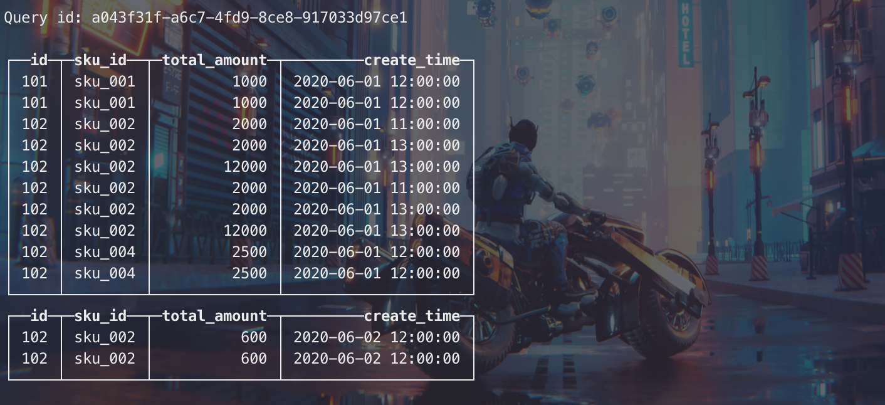</center>

<center>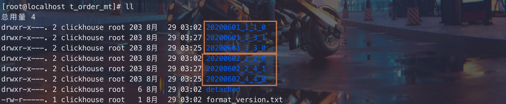</center>

可以看到一个PartitionId的数据就已经合并成功了。而也会新产生两个文件代表新的分区数据。


#### 主键（可选）
ClickHouse中的主键，和其他数据库不太一样，**它只提供了数据的一级索引，但是却不是唯一约束。**这就意味着是可以存在相同primary key的数据。

主键的设定主要依据是查询语句中的where条件。根据条件通过对主键进行某种形式的二分查找，能够定位到对应的index granularity，避免了全表扫描。

**index granularity**：直接翻译的话就是索引粒度，指在**稀疏索引中两个相邻索引对应数据的间隔**。ClickHouse中的MergeTree默认是**8192**。官方不建议修改这个值，除非该列存在大量重复值，比如在一个分区中几万行才有一个不同数据。

<center>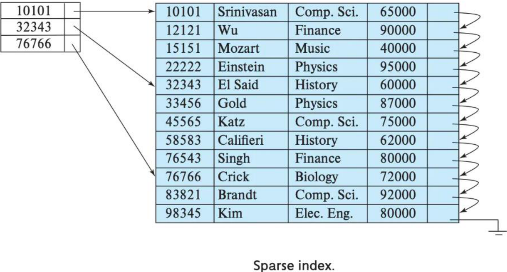</center>

稀疏索引的好处就是可以用很少的索引数据，定位更多的数据，代价就是只能定位到索引粒度的第一行，然后再进行进行一点扫描。


#### order by（必须）
order by设定了分区内的数据按照哪些字段顺序进行有序保存。order by是MergeTree中唯一一个必填项，**甚至比primary key还重要**，因为当用户不设置主键的情况，很多处理会依照order by的字段进行处理。

要求：**主键必须是order by字段的前缀字段**。

比如order by字段是(id,sku_id)，那么主键必须是id或者(id,sku_id)。


#### 一级索引

MergeTree的主键使用PRIMARY KEY定义，待主键定义之后，MergeTree会依据index_granularity间隔（默认8192行），为数据表生成一级索引并保存至**primary.idx**文件内，索引数据按照**PRIMARY KEY**排序。相比使用PRIMARY KEY定义，更为常见的是通过ORDER BY指代主键。在此种情形下，PRIMARY KEY与ORDER BY定义相同，所以索引（primary.idx）和数据（.bin）会按照完全相同的规则排序。

##### 稀疏索引

primary.idx文件内的一级索引采用稀疏索引实现

稀疏索引与稠密索引的区别：

<center>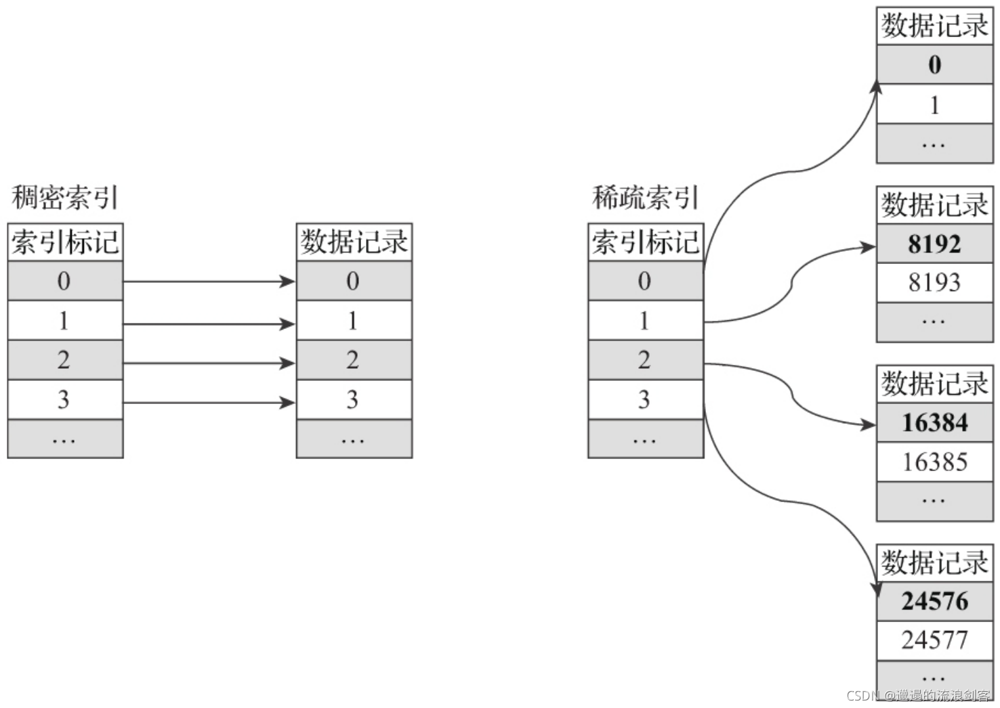</center>

- 在稠密索引中每一行索引标记都会对应到一行具体的数据记录；
- 而在稀疏索引中，每一行索引标记对应的是一段数据，而不是一行。由于稀疏索引占用空间小，所以primary.idx内的索引数据常驻内存。


##### 索引粒度

index_granularity表示索引的粒度，默认8192

<center>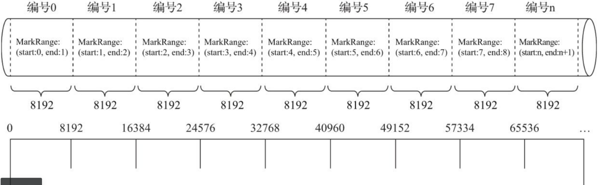</center>

数据以index_granularity的粒度被标记成多个小的区间，其中每个区别最多index_granularity行数据。MergeTree使用MarkRange表示一个具体的区间，并通过start和end表示其具体的范围


##### 索引数据的生成规则

由于是稀疏索引，所以MergeTree需要间隔index_granularity行数据才会生成一条索引记录，其索引值会依据声明的主键字段获取

**（1）使用CounterID作为主键**

<center>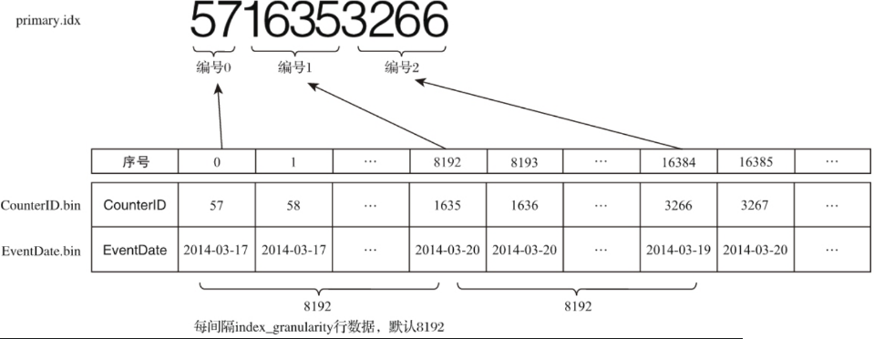</center>

该表使用年月分区（PARTITION BY toYYYYMM(EventDate)），所以2014年3月份的数据最终会被划分到同一个分区目录内。如果使用CounterID作为主键（ORDER BY CounterID），则每间隔8192行数据就会取一次CounterID的值作为索引值，索引数据最终会被写入primary.idx文件进行保存

例如第0（8192 ∗ 0）行CounterID取值57，第8192（8192 ∗ 1）行CounterID取值1635，而第16384（8192 ∗ 2）行CounterID取值3266，最终索引数据将会是5716353266

**（2）使用CounterID和EventDate作为主键**

<center>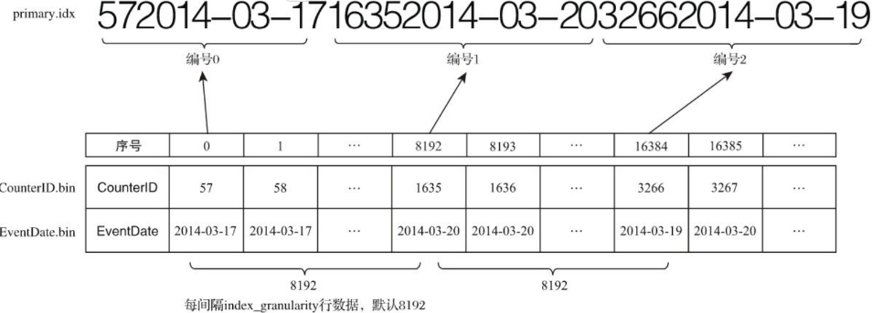</center>

如果使用多个主键，例如ORDER BY(CounterID,EventDate)，则每间隔8192行可以同时取CounterID与EventDate两列的值作为索引值，如上图所示。


##### 索引的查询过程

**（1）生成查询条件区间**

首先，将查询条件转换为条件区间，例如下面的例子：

```sql
WHERE ID = 'A003'
['A003', 'A003']

WHERE ID > 'A000'
('A000', +inf)

WHERE ID < 'A188'
(-inf, 'A188')

WHERE ID LIKE 'A006%'
['A006', 'A007')
```

**（2）递归交集判断**

以递归的形式，依次对MarkRange的数值区间与条件区间做交集判断。从最大区间[A000, +inf)开始：

- 如果不存在交集，则直接通过剪枝算法优化此整段MarkRange；
- 如果存在交集，且MarkRange步长大于8(end-start)，则将此区间进一步拆分成8个子区间（merge_tree_coarse_index_granularity指定，默认值为8），并重复此规则，继续做递归交集判断；
- 如果存在交集，且MarkRange不可再分解（步长小于8），则记录MarkRange并返回。

**（3）合并MarkRange区间**

将最终匹配的MarkRange聚在一起，合并它们的范围：
<center>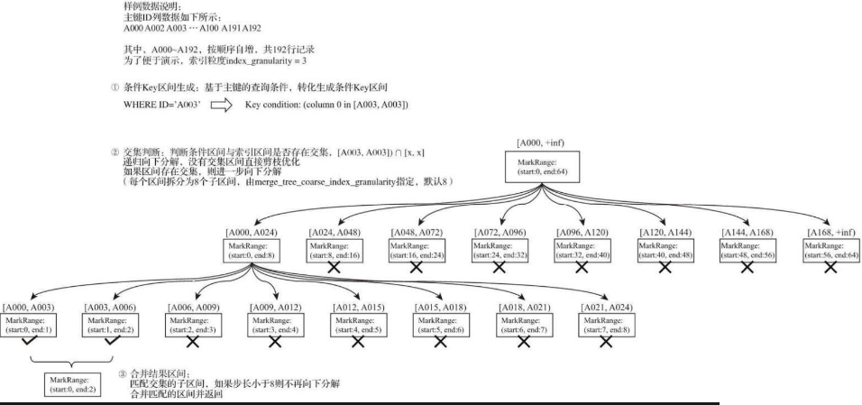</center>

MergeTree通过递归的形式持续向下拆分区间，最终将MarkRange定位到最细的粒度，以帮助在后续读取数据的时候，能够最小化扫描数据的范围。以上图为例，当查询条件WHERE ID='A003'的时候，最终只需要读取[A000, A003]和[A003, A006]两个区间的数据,它们对应MarkRange(start:0,end:2)范围，而其他无用的区间都被裁剪掉了。因为MarkRange转换的数值区间是闭区间，所以会额外匹配到临近的一个区间。


#### 二级索引

目前在ClickHouse的官网上二级索引的功能在v20.1.2.4之前是被标注为实验性的，在这个版本之后默认是开启的

**老版本使用二级索引前需要增加设置：**是否允许使用实验性的二级索引（v20.1.2.4开始，这个参数已被删除，默认开启）

```sql
set allow_experimental_data_skipping_indices=1;
```

如果在建表语句中声明了跳数索引，则会额外生成相应的索引与标记文件（`skp_idx_[Column].idx`与`skp_idx_[Column].mrk`）。

创建测试表：

```sql
create table t_order_mt2(
id UInt32,
sku_id String,
total_amount Decimal(16,2),
create_time Datetime,
INDEX a total_amount TYPE minmax GRANULARITY 5
) engine =MergeTree
partition by toYYYYMMDD(create_time)
primary key (id)
order by (id, sku_id);
```

**INDEX a total_amount TYPE minmax GRANULARITY 5**：

- a表示索引名称；
- total_amount表示索引字段；
- TYPE表示索引类型：
  - `minmax` 存储指定一段数据内的最小和最大极值（如果表达式是 `tuple` ，则存储 `tuple` 中每个元素的极值），这些信息用于跳过数据块，类似主键。
  - `set(max_rows)` 存储指定表达式的不重复值（不超过 `max_rows` 个，`max_rows=0` 则表示『无限制』）。这些信息可用于检查数据块是否满足 `WHERE` 条件。
  - `ngrambf_v1(n, size_of_bloom_filter_in_bytes, number_of_hash_functions, random_seed)` 存储一个包含数据块中所有 n元短语（ngram） 的 布隆过滤器。只可用在字符串上。 可用于优化 `equals` ， `like` 和 `in` 表达式的性能。
    - `n` – 短语长度。
    - `size_of_bloom_filter_in_bytes` – 布隆过滤器大小，字节为单位。（因为压缩得好，可以指定比较大的值，如 256 或 512）。
    - `number_of_hash_functions` – 布隆过滤器中使用的哈希函数的个数。
    - `random_seed` – 哈希函数的随机种子。
  - `tokenbf_v1(size_of_bloom_filter_in_bytes, number_of_hash_functions, random_seed)` 跟 `ngrambf_v1` 类似，但是存储的是token而不是ngrams。Token是由非字母数字的符号分割的序列。
  - `bloom_filter(bloom_filter([false_positive])` – 为指定的列存储布隆过滤器
- **GRANULARITY** 5 是设定二级索引对于一级索引粒度的粒度。

minmax索引的聚合信息是在一个index_granularity区间内数据的最小和最大值。以下图为例，假设index_granularity=8192且granularity=3，则数据会按照index_granularity划分为n等份，MergeTree从第0段分区开始，依次获取聚合信息。当获取到第3个分区时（granularity=3），则汇总并会生成第一行minmax索引（前3段minmax汇总后取值为[1, 9]）：

<center>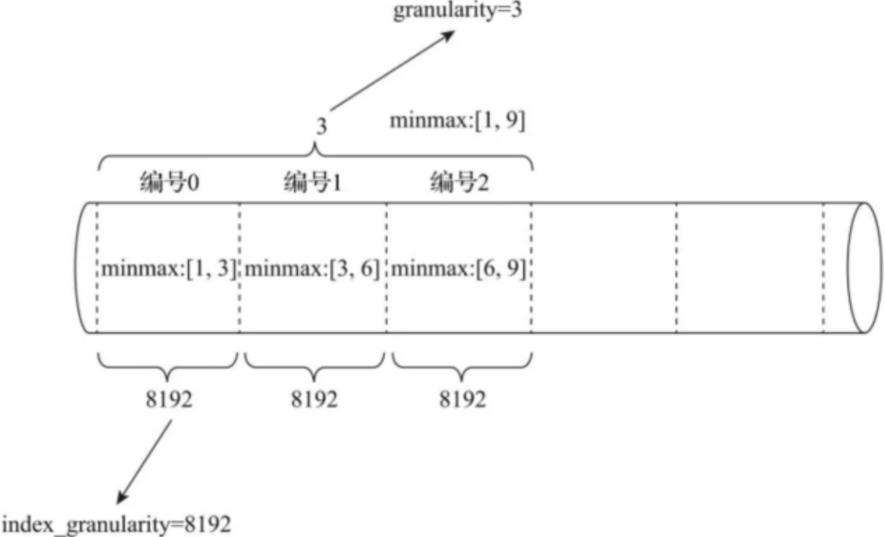</center>

插入数据：

```sql
insert into t_order_mt2 values
(101,'sku_001',1000.00,'2020-06-01 12:00:00') ,
(102,'sku_002',2000.00,'2020-06-01 11:00:00'),
(102,'sku_004',2500.00,'2020-06-01 12:00:00'),
(102,'sku_002',2000.00,'2020-06-01 13:00:00'),
(102,'sku_002',12000.00,'2020-06-01 13:00:00'),
(102,'sku_002',600.00,'2020-06-02 12:00:00');
```

对比效果：

```sql
clickhouse-client --send_logs_level=trace <<< 'select * from t_order_mt2 where total_amount > toDecimal32(900., 2)';
```

<center>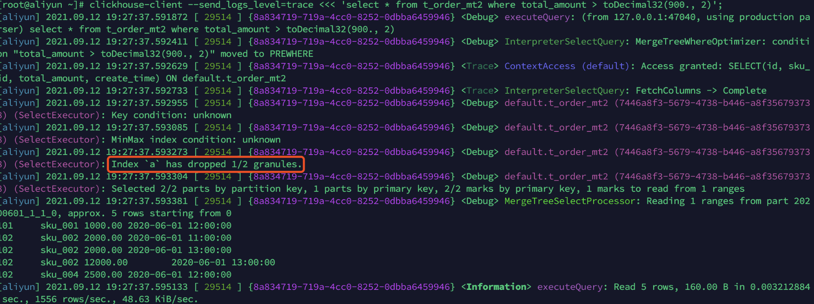</center>

日志中可以看到二级索引能够为非主键字段的查询发挥作用

分区下文件`skp_idx_a.idx`和`skp_idx_a.mrk3`为跳数索引文件：

```bash
checksums.txt  count.txt  data.mrk3                      minmax_create_time.idx  primary.idx    skp_idx_a.mrk3
columns.txt    data.bin   default_compression_codec.txt  partition.dat           skp_idx_a.idx
```


#### 数据TTL

MergeTree提供了可以管理数据**表**或者**列**的生命周期的功能。

（1）**列级TTL**

当列中的值过期时, **ClickHouse会将它们替换成该列数据类型的默认值**。如果数据片段中列的所有值均已过期，则ClickHouse 会从文件系统中的数据片段中**删除此列**。TTL的列**必须是日期类型且不能为主键**。

```sql
create table t_order_mt3(
id UInt32,
sku_id String,
total_amount Decimal(16,2) TTL create_time+interval 10 SECOND,
create_time Datetime 
) engine =MergeTree
partition by toYYYYMMDD(create_time)
primary key (id)
order by (id, sku_id);
```

插入数据（请根据实际时间修改数据，注意是linux的时间）：

```sql
insert into t_order_mt3 values
(106,'sku_001',1000.00,'2022-08-29 04:14:20'),
(107,'sku_002',2000.00,'2022-08-29 04:14:20'),
(110,'sku_003',600.00,'2022-08-29 04:14:20');
```

手动合并，查看效果：到期后，指定的字段数据归0：

```sql
optimize table t_order_mt3 final;
select * from t_order_mt3;
```

<center>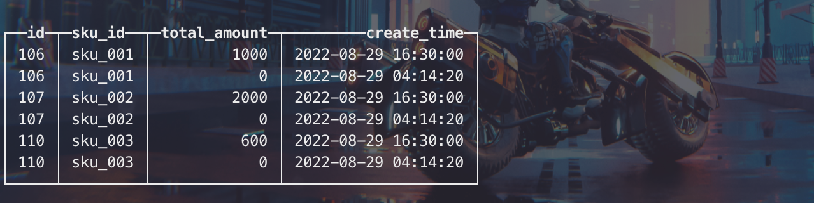</center>


（2）**表级TTL**

表可以设置一个用于**移除过期行**的表达式，以及多个用于在磁盘或卷上自动转移数据片段的表达式。**当表中的行过期时，ClickHouse 会删除所有对应的行**。对于数据片段的转移特性，必须所有的行都满足转移条件。

下面的这条语句是数据会在create_time之后10秒丢失：

```sql
alter table t_order_mt3 MODIFY TTL create_time + INTERVAL 10 SECOND;
```

```sql
[TTL expr [DELETE|TO DISK 'xxx'|TO VOLUME 'xxx'], ...]
```

TTL 规则的类型紧跟在每个 TTL 表达式后面，它会影响满足表达式时（到达指定时间时）应当执行的操作：

- `DELETE` - 删除过期的行（**默认操作**）;
- `TO DISK 'aaa'` - 将数据片段移动到磁盘 `aaa`;
- `TO VOLUME 'bbb'` - 将数据片段移动到卷 `bbb`.
- `GROUP BY` - 聚合过期的行

涉及判断的字段必须是Date或者Datetime类型，推荐使用分区的日期字段

能够使用的时间周期：

- SECOND
- MINUTE
- HOUR
- DAY
- WEEK
- MONTH
- QUARTER
- YEAR


#### 数据存储

（1）**各列独立存储**
在MergeTree中，数据按列存储。而具体到每个列字段，数据也是独立存储的，每个列字段都拥有一个与之对应的.bin数据文件。数据文件以分区目录的形式被组织存放，所以在.bin文件中只会保存当前分区片段内的这一部分数据。按列独立存储的设计优势显而易见：

- 可以更好地进行数据压缩（相同类型的数据放在一起，对压缩更加友好）；
- 能够最小化数据扫描的范围。

数据是经过压缩的，目前支持LZ4、ZSTD、Multiple和Delta几种算法，默认使用LZ4算法；其次，数据会事先依照ORDER BY的声明排序；最后，数据是以压缩数据块的形式被组织并写入.bin文件中的

（2）**压缩数据块**
一个压缩数据块由头信息和压缩数据两部分组成。头信息固定使用9位字节表示，具体由1个UInt8（1字节）整型和2个UInt32（4字节）整型组成，分别代表使用的压缩算法类型、压缩后的数据大小和压缩前的数据大小，如下图所示：

<center>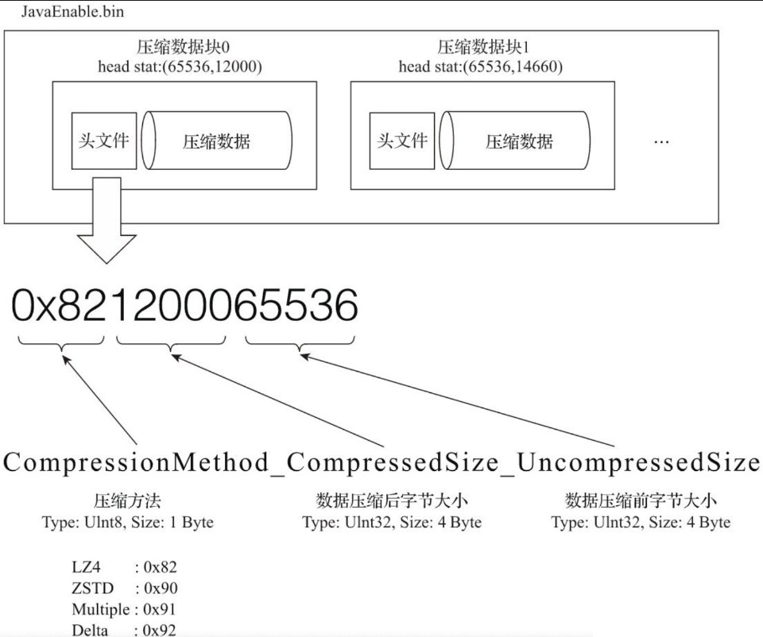</center>

MergeTree在数据具体的写入过程中，会按照索引粒度（默认情况下，每次取8192行），按批次获取数据并进行处理。如果把一批数据的未压缩大小设为size，则整个写入过程遵循以下规则：

- 单个批次数据size < 64KB：如果单个批次数据小于64KB，则继续获取下一批数据，直至累积到size >= 64KB时，生成下一个压缩数据块；
- 单个批次数据64KB <= size <= 1MB：如果单个批次数据大小恰好在64KB与1MB之间，则直接生成下一个压缩数据块；
- 单个批次数据size > 1MB：如果单个批次数据直接超过1MB，则首先按照1MB大小截断并生成下一个压缩数据块。剩余数据继续依照上述规则执行。此时，会出现一个批次数据生成多个压缩数据块的情况。

<center>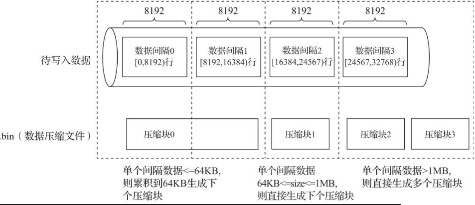</center>

一个.bin文件是由1至多个压缩数据块组成的，每个压缩块大小在64KB～1MB之间。多个压缩数据块之间，按照写入顺序首尾相接，紧密地排列在一起。


#### 数据标记

##### 数据标记的生成规则

<center>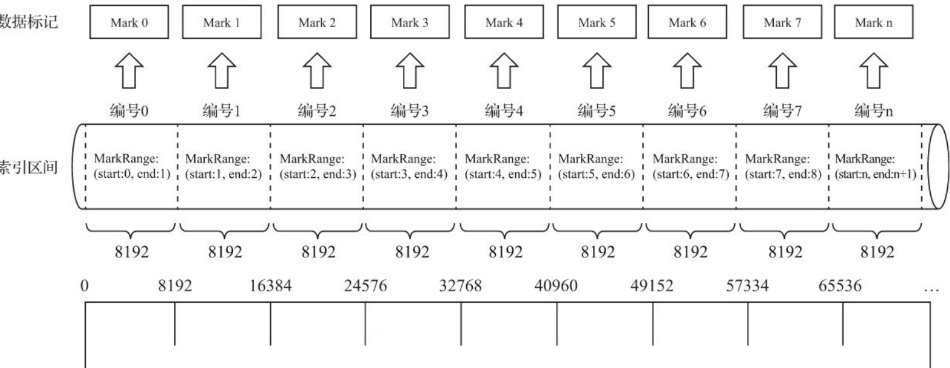</center>

从上图中可以发现，**数据标记和索引区间是对齐的**，均按照index_granularity的粒度间隔。

数据标记文件与.bin文件一一对应，每一个列字段[Column].bin文件都有一个与之对应的[Column].mrk数据标记文件，用于记录数据在.bin文件中的偏移量信息

一行标记数据使用一个元组表示，元组内包含两个整型数值的偏移量信息。它们分别表示此段数据区间内，在对应的.bin压缩文件中，压缩数据块的起始偏移量；以及将该数据压缩块解压后，其未压缩数据的起始偏移量：

<center>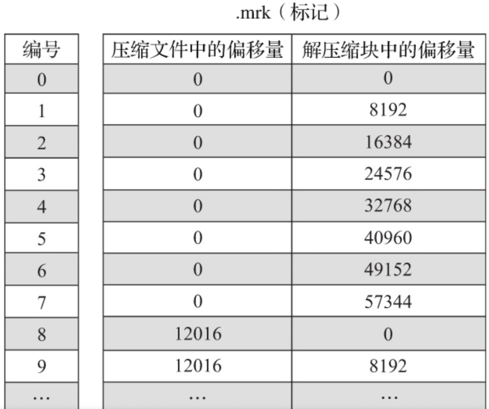</center>

每一行标记数据都表示了一个片段的数据（默认8192行）在.bin压缩文件中的读取位置信息。标记数据与一级索引数据不同，它并不能常驻内存，而是使用LRU（最近最少使用）缓存策略加快其取用速度。


##### 数据标记的工作方式

下图为为hits_v1测试表的JavaEnable字段及其标记数据与压缩数据的对应关系：

<center>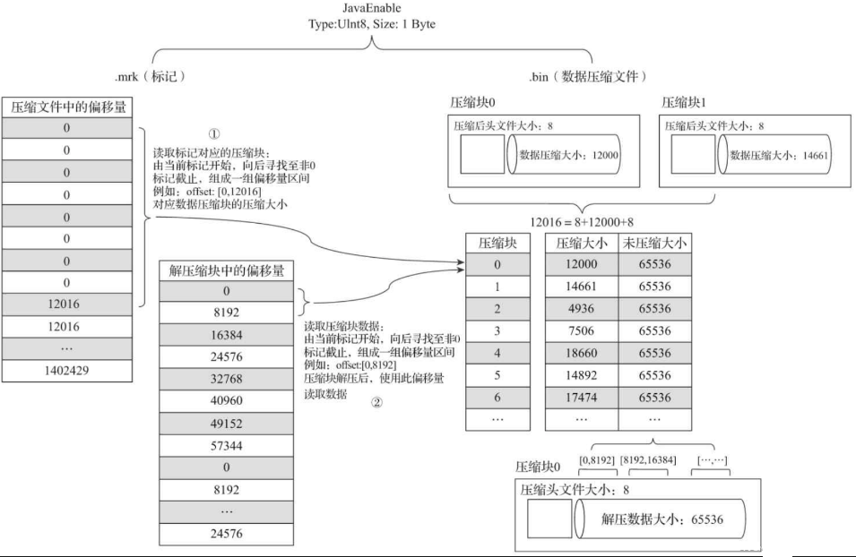</center>

JavaEnable字段的数据类型为UInt8，所以每行数值占用1字节。而hits_v1数据表的index_granularity粒度为8192，所以一个索引片段的数据大小恰好是8192B。按照压缩数据块的生成规则，如果单个批次数据小于64KB，则继续获取下一批数据，直至累积到size >= 64KB时，生成下一个压缩数据块。因此在JavaEnable的标记文件中，每8行标记数据对应1个压缩数据块（1B*8192=8192B，64KB=65536B，65536/8192=8）。所以，从上图能够看到，其左侧的标记数据中，8行数据的压缩文件偏移量都是相同的，因为这8行标记都指向了同一个压缩数据块。而在这8行的标记数据中，它们的解压缩数据块中的偏移量，则依次按照8192B（每行数据1B，每一个批次8192行数据）累加，当累加达到65536（64KB）时则置0。因为根据规则，此时会生成下一个压缩数据块。

（1）**读取压缩数据块**

上下相邻的两个压缩文件中的起始偏移量，构成了与获取当前标记对应的压缩数据块的偏移量区间。由当前标记数据开始，向下寻找，直到找到不同的压缩文件偏移量为止。此时得到的一组偏移量区间即时压缩数据块在.bin文件中的偏移量。如上图所示，读取右侧.bin文件中[0, 12016]（8+12000+8=12016）字节数据，就能获得第0个压缩数据块。

压缩数据块被整个加载到内存之后，会进行解压，在这之后就进入具体数据的读取环节了。

（2）**读取数据**

在读取解压后的数据时，MergeTree并不需要一次性扫描整段解压数据，它可以根据需要，以index_granularity的粒度加载特定的一小段

上下相邻两个解压缩数据块中的起始偏移量，构成了与获取当前标记对应的数据的偏移区间。通过这个区间能够在它的压缩块被解压之后，依照偏移量按需读取数据，如上图所示，通过[0, 8192]能够读取压缩数据块0中的第一个数据片段。


##### 数据标记与压缩数据块的对应关系

由于压缩数据块的划分，与一个间隔（index_granularity）内的数据大小相关，每个压缩数据块的体积都被严格控制在64KB～1MB。而一个间隔（index_granularity）的数据，又只会产生一行数据标记。那么根据一个间隔内数据的实际字节大小，数据标记和压缩数据块之间会产生三种不同的对应关系：

（1）**多对一**

多个数据标记对应一个压缩数据块，当一个间隔（index_granularity）内的数据未压缩大小size小于64KB时，会出现这种对应关系

以hits_v1测试表的JavaEnable字段为例。JavaEnable数据类型为UInt8，大小为1B，则一个间隔内数据大小为8192B。所以在此种情形下，每8个数据标记会对应同一个压缩数据块
<center>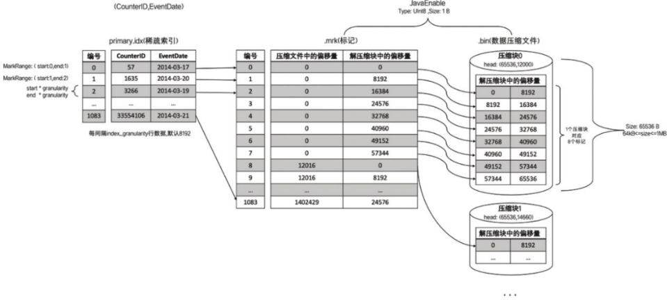</center>


（2）**一对一**

一个数据标记对应一个压缩数据块，当一个间隔（index_granularity）内的数据未压缩大小size大于等于64KB且小于等于1MB时，会出现这种对应关系。

以hits_v1测试表的URLHash字段为例。URLHash数据类型为UInt64，大小为8B，则一个间隔内数据大小为65536B，恰好等于64KB。所以在此种情形下，数据标记与压缩数据块是一对一的关系。

<center>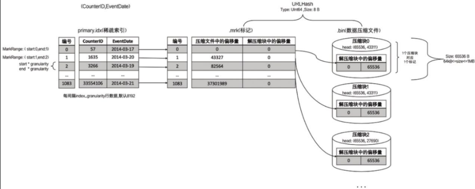</center>


（3）**一对多**

一个数据标记对应多个压缩数据块，当一个间隔（index_granularity）内的数据未压缩大小size直接大于1MB时，会出现这种对应关系。

以hits_v1测试表的URL字段为例。URL数据类型为String，大小根据实际内容而定。

<center>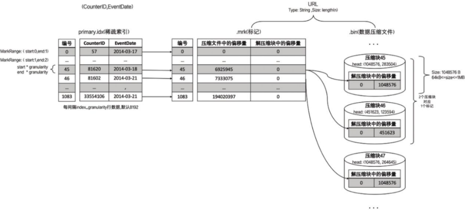</center>


#### 小节

##### 写入过程

数据写入的第一步是生成分区目录，伴随着每一批数据的写入，都会生成一个新的分区目录。在后续的某一时刻，属于相同分区的目录会依照规则合并到一起；接着，按照index_granularity索引粒度，会分别生成primary.idx一级索引（如果声明了二级索引，还会创建二级索引文件）、每一个列字段的.mrk数据标记和.bin压缩数据文件：

<center>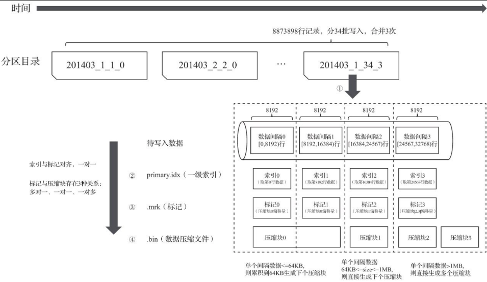</center>

从分区目录201403_1_34_3能够得知，该分区数据共分34批写入，期间发生过3次合并。在数据写入的过程中，依据index_granularity的粒度，依次为每个区间的数据生成索引、标记和压缩数据块。


##### 查询过程

在最理想的情况下，MergeTree首先可以依次借助分区索引、一级索引和二级索引，将数据扫描范围缩至最小。然后再借助数据标记，将需要解压与计算的数据范围缩至最小

<center>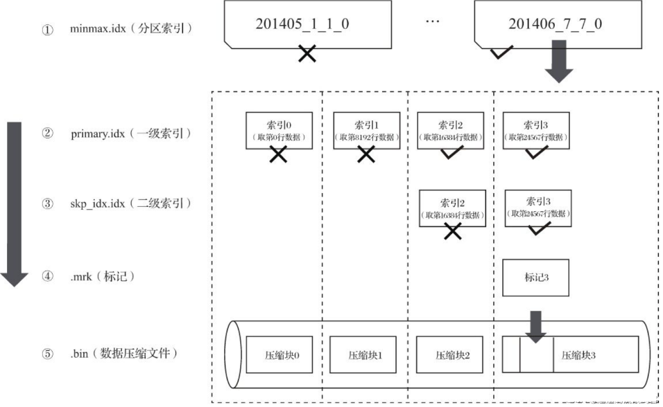</center>

如果一条查询语句没有指定任何WHERE条件，或是指定了WHERE条件，但条件没有匹配到任何索引（分区索引、一级索引和二级索引），那么MergeTree就不能预先减小数据范围。在后续进行数据查询时，它会扫描所有分区目录，以及目录内索引段的最大区间。虽然不能减少数据范围，但是MergeTree仍然能够借助数据标记，以多线程的形式同时读取多个压缩数据块，以提升性能。

> 这张图按我的理解来看二级索引有点问题。


### ReplacingMergeTree
ReplacingMergeTree是MergeTree的一个变种，它存储特性完全继承MergeTree，只是多了一个去重的功能

1. **去重时机**。**只有同一批插入（新版本）或合并分区时才会进行去重**。合并会在未知的时间在后台进行，所以你无法预先作出计划。有一些数据可能仍未被处理；

2. **去重范围**。如果表经过了分区，**去重只会在分区内部进行去重，不能执行跨分区的去重**；
3. **实际上是使用order by字段作为唯一键进行去重；**
4. **认定重复的数据保留，版本字段值最大的；**
5. **如果版本字段相同则按插入顺序保留最后一笔**

所以ReplacingMergeTree能力有限，ReplacingMergeTree适用于在后台清除重复的数据以节省空间，但是它不保证没有重复的数据出现。

```sql
create table t_order_rmt(
    id UInt32,
    sku_id String,
    total_amount Decimal(16,2) ,
    create_time Datetime 
) engine =ReplacingMergeTree(create_time)
partition by toYYYYMMDD(create_time)
primary key (id)
order by (id, sku_id);
```

**`ReplacingMergeTree()`填入的参数为版本字段，重复数据保留版本字段值最大的。如果不填版本字段，默认按照插入顺序保留最后一条**

插入数据：

```sql
insert into t_order_rmt values
(101,'sku_001',1000.00,'2020-06-01 12:00:00') ,
(102,'sku_002',2000.00,'2020-06-01 11:00:00'),
(102,'sku_004',2500.00,'2020-06-01 12:00:00'),
(102,'sku_002',2000.00,'2020-06-01 13:00:00'),
(102,'sku_002',12000.00,'2020-06-01 13:00:00'),
(102,'sku_002',600.00,'2020-06-02 12:00:00');
```

执行查询操作：

```sql
select * from t_order_rmt;
```

<center>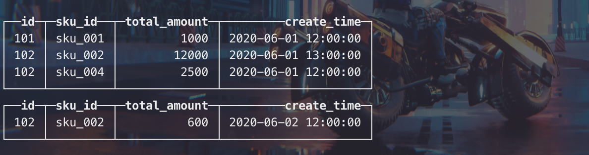</center>


### SummingMergeTree

对于不查询明细，只关心以维度进行汇总聚合结果的场景。如果只使用普通的MergeTree的话，无论是存储空间的开销，还是查询时临时聚合的开销都比较大

ClickHouse为了这种场景，提供了一种能够预聚合的引擎SummingMergeTree。

- 以SummingMergeTree()中指定的列作为汇总数据列；
- 可以填写多列必须数字列，如果不填，以所有非维度列（除了order by的列之外）且为数字列的字段为汇总数据列；
- 以order by的列为准，作为维度列；
- 其他的列按插入顺序保留第一行；
- 不在一个分区的数据不会被聚合；
- 只有在同一批次插入（新版本）或分片合并时才会进行聚合
  

```SQL
create table t_order_smt(
    id UInt32,
    sku_id String,
    total_amount Decimal(16,2) ,
    create_time Datetime 
) engine =SummingMergeTree(total_amount)
partition by toYYYYMMDD(create_time)
primary key (id)
order by (id,sku_id );
```

插入数据：

```sql
insert into t_order_smt values
(101,'sku_001',1000.00,'2020-06-01 12:00:00'),
(102,'sku_002',2000.00,'2020-06-01 11:00:00'),
(102,'sku_004',2500.00,'2020-06-01 12:00:00'),
(102,'sku_002',2000.00,'2020-06-01 13:00:00'),
(102,'sku_002',12000.00,'2020-06-01 13:00:00'),
(102,'sku_002',600.00,'2020-06-02 12:00:00');
```

执行查询操作：

<center>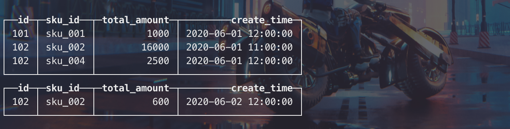</center>


## SQL操作

### Insert

基本与标准SQL（MySQL）基本一致：

1. 标准：

   ```sql
   insert into [table_name] values(…),(…)
   ```

2. 从表中插入表：

   ```sql
   insert into [table_name] select a,b,c from [table_name_2]
   ```

### Update和Delete

ClickHouse提供了Delete和Update的能力，这类操作被称为Mutation查询，它可以看做Alter的一种。虽然可以实现修改和删除，但是和一般的OLTP数据库不一样，**Mutation语句是一种很重的操作，而且不支持事务**。

**重的原因主要是每次修改或者删除都会导致放弃目标数据的原有分区，重建新分区，所以尽量做批量的变更，不要进行频繁小数据的操作**。

1. 删除操作：

   ```sql
   alter table t_order_smt delete where sku_id ='sku_001';
   ```

2. 修改操作：

   ```sql
   alter table t_order_smt update total_amount=toDecimal32(2000.00,2) where id=102;
   ```


由于操作比较重，所以Mutation语句分两步执行，同步执行的部分其实只是进行新增数据、新增分区和并把旧分区打上逻辑上的失效标记。直到触发分区合并的时候，才会删除旧数据释放磁盘空间，一般不会开放这样的功能给用户，由管理员完成。


### 查询操作
ClickHouse基本上与标准SQL差别不大：

- 支持子查询；
- 支持CTE（Common Table Expression公用表表达式with子句）；
- 支持各种JOIN，但是JOIN操作无法使用缓存，所以即使是两次相同的JOIN语句，ClickHouse也会视为两条新SQL；
- 不支持自定义函数；
- GROUP BY操作增加了**with rollup、with cube、with total**用来计算小计和总计。

测试下GROUP BY的三种操作，看下数据：

```sql
┌──id─┬─sku_id──┬─total_amount─┬─────────create_time─┐
│ 101 │ sku_001 │         1000 │ 2020-06-01 12:00:00 │
│ 101 │ sku_001 │         1000 │ 2020-06-01 12:00:00 │
│ 102 │ sku_002 │         2000 │ 2020-06-01 11:00:00 │
│ 102 │ sku_002 │         2000 │ 2020-06-01 13:00:00 │
│ 102 │ sku_002 │        12000 │ 2020-06-01 13:00:00 │
│ 102 │ sku_002 │         2000 │ 2020-06-01 11:00:00 │
│ 102 │ sku_002 │         2000 │ 2020-06-01 13:00:00 │
│ 102 │ sku_002 │        12000 │ 2020-06-01 13:00:00 │
│ 102 │ sku_004 │         2500 │ 2020-06-01 12:00:00 │
│ 102 │ sku_004 │         2500 │ 2020-06-01 12:00:00 │
└─────┴─────────┴──────────────┴─────────────────────┘
┌──id─┬─sku_id──┬─total_amount─┬─────────create_time─┐
│ 102 │ sku_002 │          600 │ 2020-06-02 12:00:00 │
│ 102 │ sku_002 │          600 │ 2020-06-02 12:00:00 │
└─────┴─────────┴──────────────┴─────────────────────┘
```

1. **with rollup：从右至左去掉维度进行小计**

   ```sql
   select id,sku_id,sum(total_amount) from t_order_mt group by id,sku_id with rollup;
   ```

   <center>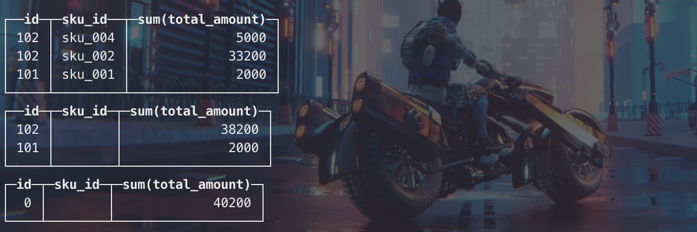</center>

2. **with cube : 从右至左去掉维度进行小计，再从左至右去掉维度进行小计**

   ```sql
   select id,sku_id,sum(total_amount) from t_order_mt group by id,sku_id with cube;
   ```

   <center></center>

3. **with totals: 只计算合计**

   ```sql
   select id,sku_id,sum(total_amount) from t_order_mt group by id,sku_id with totals;
   ```

   <center>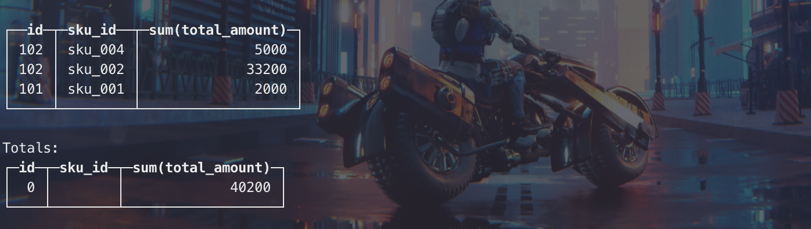</center>


### alter操作

同MySQL的修改字段基本一致。

1. **新增字段**

   ```sql
   alter table tableName add column newcolname String after col1; 
   ```

2. **修改字段类型**

   ```sql
   alter table tableName modify column newcolname String; 
   ```

3. **删除字段**

   ```sql
   alter table tableName drop column newcolname; 
   ```


### 导出数据

```sql
clickhouse-client --query "select * from t_order_mt where create_time='2022-08-28 12:00:00'" --format CSVWithNames> /opt/module/data/rs1.csv
```

更多支持格式参照：[https://clickhouse.tech/docs/en/interfaces/formats/](https://clickhouse.tech/docs/en/interfaces/formats/)


## 副本和分片

副本的目的主要是保障数据的高可用性，即使一台 ClickHouse 节点宕机，那么也可以从其他服务器获得相同的数据。

https://clickhouse.tech/docs/en/engines/table-engines/mergetree-family/replication/

### 副本

<center>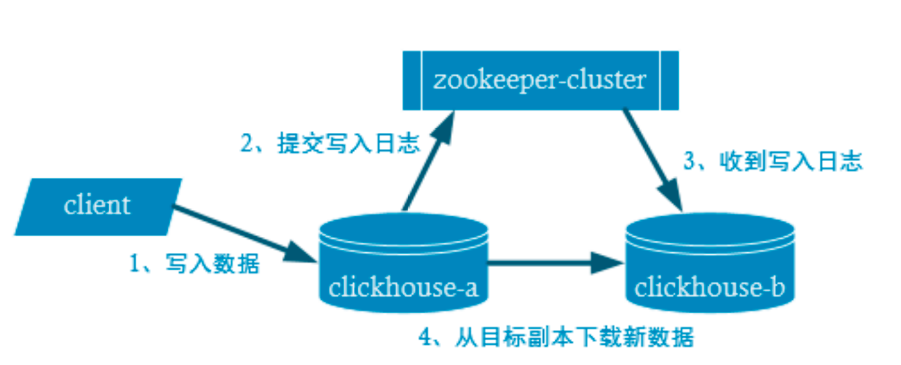</center>

**副本之间是互相进行同步的。**

（1）启动zookeeper集群

（2）在 hadoop102 的/etc/clickhouse-server/config.d 目录下创建一个名为 **metrika.xml** 的配置文件,内容如下：

> 注：也可以不创建外部文件，直接在 config.xml 中指定

```xml
<?xml version="1.0"?>
<yandex>
	<zookeeper-servers>
	<node index="1">
		<host>hadoop102</host>
		<port>2181</port>
	</node>
	<node index="2">
		<host>hadoop103</host>
		<port>2181</port>
	</node>
	<node index="3">
		<host>hadoop104</host>
		<port>2181</port>
	</node>
	</zookeeper-servers>
</yandex>
```

（3）同步到 hadoop103 和 hadoop104 上

```bash
sudo /home/atguigu/bin/xsync /etc/clickhouse-server/config.d/metrika.xml
```

（4）在 hadoop102 的/etc/clickhouse-server/config.xml中增加

```bash
<zookeeper incl="zookeeper-servers" optional="true" />
<include_from>/etc/clickhouse-server/config.d/metrika.xml</include_from>
```

<center>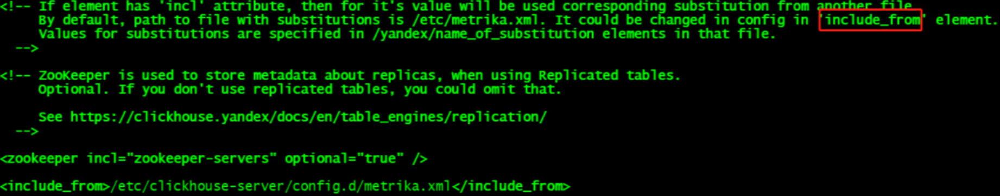</center>

（5）同步到 hadoop103 和 hadoop104 上

```sql
sudo /home/atguigu/bin/xsync /etc/clickhouse-server/config.xml
```

分别在 hadoop102 和 hadoop103 上启动 ClickHouse 服务

注意：因为修改了配置文件，如果以前启动了服务需要重启

```bash
sudo clickhouse restart
```

注意：我们演示副本操作只需要在 hadoop102 和 hadoop103 两台服务器即可，上面的操作，我们 hadoop104 可以你不用同步，我们这里为了保证集群中资源的一致性，做了同步。

（6）在 hadoop102 和 hadoop103 上分别建表

副本只能同步数据，不能同步表结构，所以**我们需要在每台机器上自己手动建表**。

```sql
create table t_order_rep2 (
    id UInt32,
    sku_id String,
    total_amount Decimal(16,2),
    create_time
    Datetime
) engine = ReplicatedMergeTree('/clickhouse/table/01/t_order_rep','rep_102')
partition by toYYYYMMDD(create_time)
primary key (id)
order by (id,sku_id);
```

ReplicatedMergeTree(‘/clickhouse/table/01/t_order_rep’,‘rep_102’)中：

- 第一个参数是分片的 zk_path ， 一般按照：**/clickhouse/table/{shard}/{table_name}** 的格式写，如果只有一个分片就写 01 即可；
- 第二个参数是**分片副本名称**，相同的分片副本名称不能相同。


（7）在 hadoop102 上执行 insert 语句

```sql
insert into t_order_rep2 values
(101,'sku_001',1000.00,'2020-06-01 12:00:00'),
(102,'sku_002',2000.00,'2020-06-01 12:00:00'),
(103,'sku_004',2500.00,'2020-06-01 12:00:00'),
(104,'sku_002',2000.00,'2020-06-01 12:00:00'),
(105,'sku_003',600.00,'2020-06-02 12:00:00');
```


（8）在 hadoop103 上执行 select，可以查询出结果，说明副本配置正确

<center>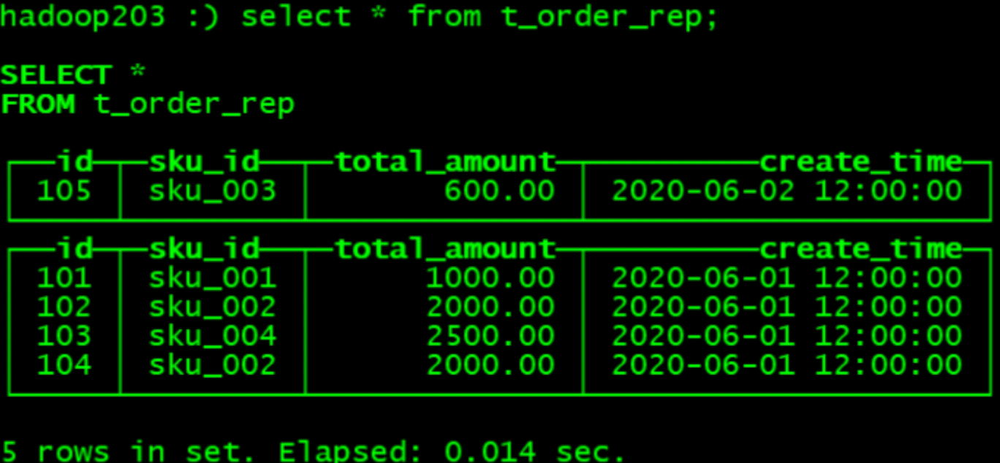</center>


### 分片

副本虽然能够提高数据的可用性，降低丢失风险，但是每台服务器实际上必须容纳全量数据，对数据的横向扩容没有解决。

要解决数据**水平切分**的问题，需要引入分片的概念。通过分片把一份完整的数据进行切分，不同的分片分布到不同的节点上，再通过 Distributed 表引擎把数据拼接起来一同使用。

Distributed 表引擎本身不存储数据，有点类似于 MyCat 之于 MySql，成为一种中间件，通过分布式逻辑表来写入、分发、路由来操作多台节点不同分片的分布式数据。

注意：ClickHouse 的集群是表级别的，实际企业中，大部分做了高可用，但是没有用分片，避免降低查询性能以及操作集群的复杂性。

#### 集群写入流程（3 分片 2 副本共 6 个节点）

<center>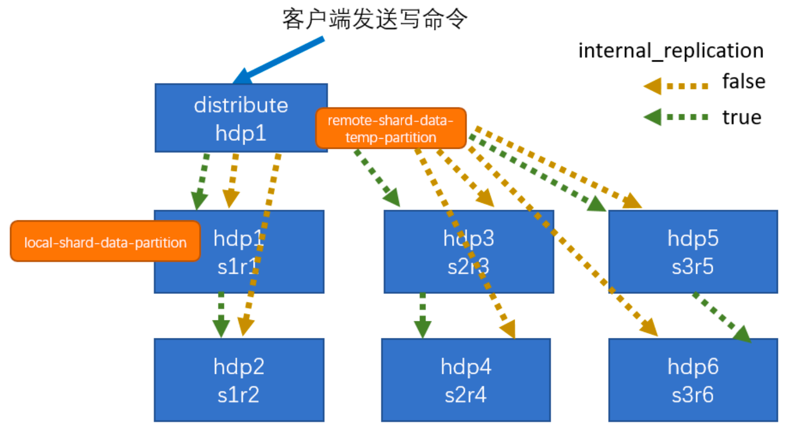</center>


#### 集群读取流程（3 分片 2 副本共 6 个节点）

<center>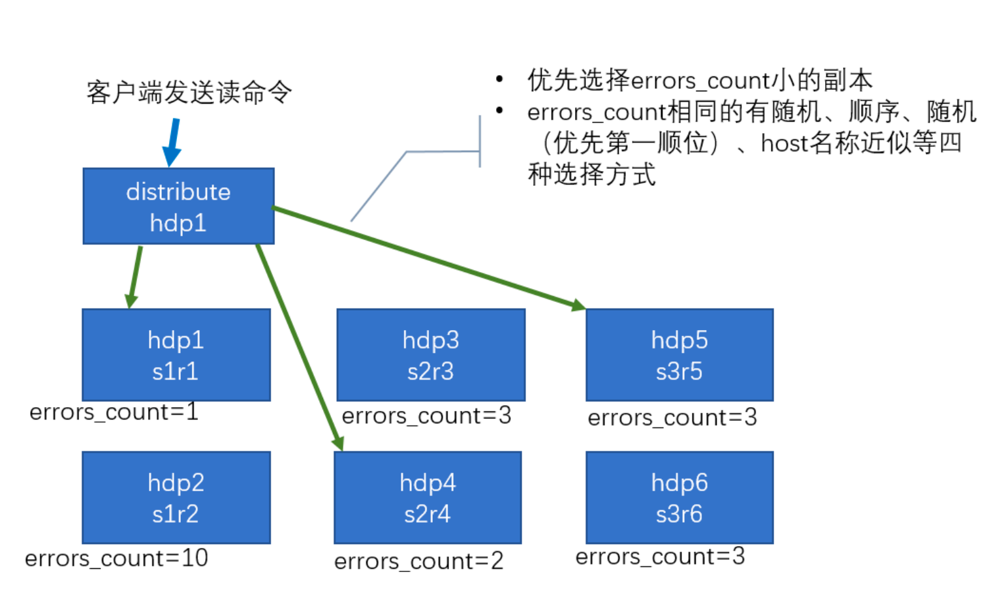</center>


#### 3分片2副本共6个节点集群配置（供参考）

配置的位置还是在之前的/etc/clickhouse-server/config.d/**metrika.xml**，内容如下：

> 注：也可以不创建外部文件，直接在 config.xml 的<remote_servers>中指定

```xml
<yandex>
	<remote_servers>
		<gmall_cluster> <!-- 集群名称--> 
			<shard> <!--集群的第一个分片-->
				<internal_replication>true</internal_replication>
				<!--该分片的第一个副本-->
				<replica> 
					<host>hadoop101</host>
					<port>9000</port>
				</replica>
				<!--该分片的第二个副本-->
				<replica> 
					<host>hadoop102</host>
					<port>9000</port>
				</replica>
			</shard>
			<shard> <!--集群的第二个分片-->
				<internal_replication>true</internal_replication>
				<replica> <!--该分片的第一个副本-->
					<host>hadoop103</host>
					<port>9000</port>
				</replica>
				<replica> <!--该分片的第二个副本-->
					<host>hadoop104</host>
					<port>9000</port>
				</replica>
			</shard>
			<shard> <!--集群的第三个分片-->
				<internal_replication>true</internal_replication>
				<replica> <!--该分片的第一个副本-->
					<host>hadoop105</host>
					<port>9000</port>
				</replica>
				<replica> <!--该分片的第二个副本-->
					<host>hadoop106</host>
					<port>9000</port>
				</replica>
			</shard>
		</gmall_cluster>
	</remote_servers>
</yandex>
```


#### 配置三节点版本集群及副本

集群及副本规划（2 个分片，只有第一个分片有副本）：

<center>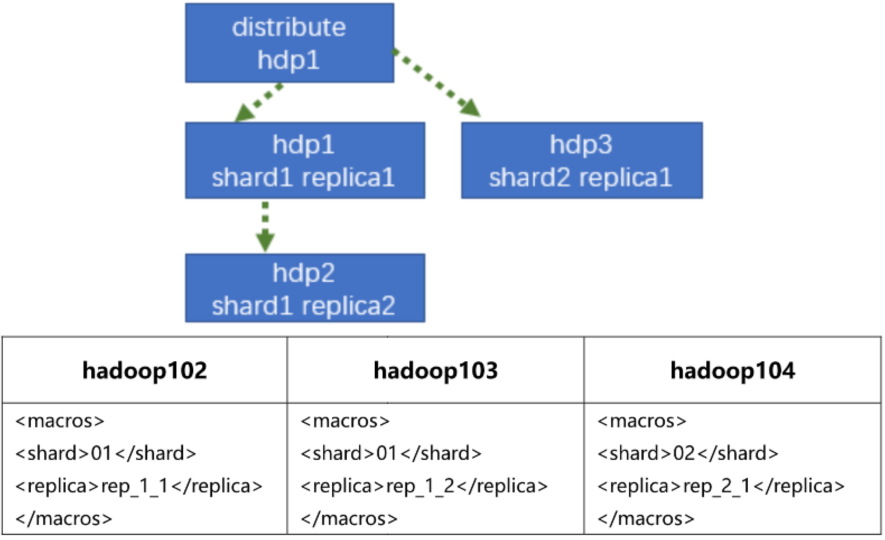</center>


配置步骤：

（1）在 hadoop102 的/etc/clickhouse-server/config.d 目录下创建 **metrika-shard.xml** 文件

> 注：也可以不创建外部文件，直接在 config.xml 的<remote_servers>中指定

```xml
<?xml version="1.0"?>
<yandex>
	<remote_servers>
		<gmall_cluster> <!-- 集群名称--> 
			<shard> <!--集群的第一个分片-->
				<internal_replication>true</internal_replication>
				<replica> <!--该分片的第一个副本-->
					<host>hadoop102</host>
					<port>9000</port>
				</replica>
				<replica> <!--该分片的第二个副本-->
					<host>hadoop103</host>
					<port>9000</port>
				</replica>
			</shard>
			<shard> <!--集群的第二个分片-->
				<internal_replication>true</internal_replication>
				<replica> <!--该分片的第一个副本-->
					<host>hadoop104</host>
					<port>9000</port>
				</replica>
			</shard>
		</gmall_cluster>
	</remote_servers>
	<zookeeper-servers>
		<node index="1">
			<host>hadoop102</host>
			<port>2181</port>
		</node>
		<node index="2">
			<host>hadoop103</host>
			<port>2181</port>
		</node>
		<node index="3">
			<host>hadoop104</host>
			<port>2181</port>
		</node>
	</zookeeper-servers>
	<macros>
		<shard>01</shard> <!--不同机器放的分片数不一样-->
		<replica>rep_1_1</replica> <!--不同机器放的副本数不一样-->
	</macros>
</yandex>
```


（2）将 hadoop102 的 metrika-shard.xml 同步到 103 和 104

```bash
sudo /home/atguigu/bin/xsync /etc/clickhouse-server/config.d/metrika-shard.xml
```


（3）修改 103 和 104 中 metrika-shard.xml 宏的配置

<center>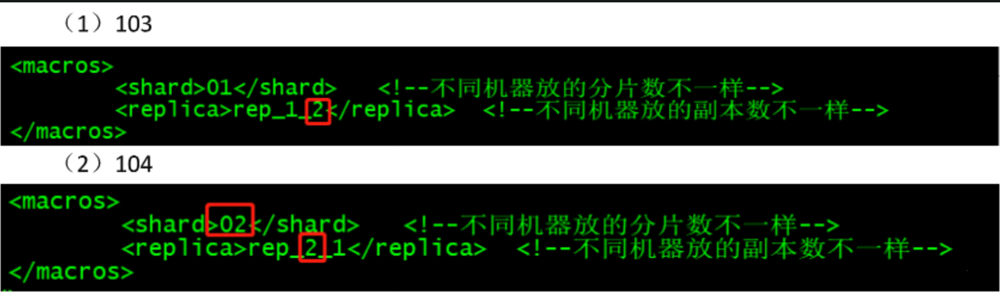</center>


（4）在 hadoop102 上修改/etc/clickhouse-server/config.xml

```xml
<include_from>/etc/clickhouse-server/config.d/metrika-shard.xml</include_from>
```


（5）同步/etc/clickhouse-server/config.xml 到 103 和 104

```bash
sudo /home/atguigu/bin/xsync /etc/clickhouse-server/config.xml
```


（6）重启三台服务器上的 ClickHouse 服务

（7）在 hadoop102 上执行建表语句

- **会自动同步到 hadoop103 和 hadoop104 上**
- 集群名字要和配置文件中的一致
- 分片和副本名称从配置文件的宏定义中获取

```sql
create table st_order_mt on cluster gmall_cluster (
    id UInt32,
    sku_id String,
    total_amount Decimal(16,2),
    create_time Datetime
) engine 
=ReplicatedMergeTree('/clickhouse/tables/{shard}/st_order_mt','{replica}')
partition by toYYYYMMDD(create_time)
primary key (id)
order by (id,sku_id);
```


（8）在 hadoop102 上创建 Distribute 分布式表

```sql
create table st_order_mt_all2 on cluster gmall_cluster
(
    id UInt32,
    sku_id String,
    total_amount Decimal(16,2),
    create_time
    Datetime
)engine = Distributed(gmall_cluster,default, st_order_mt,hiveHash(sku_id));
```

参数含义：

- Distributed（集群名称，库名，本地表名，分片键）
- 分片键必须是整型数字，所以用 hiveHash 函数转换，也可以 rand()


（9）在 hadoop102 上插入测试数据

```sql
insert into st_order_mt_all2 values
(201,'sku_001',1000.00,'2020-06-01 12:00:00') ,
(202,'sku_002',2000.00,'2020-06-01 12:00:00'),
(203,'sku_004',2500.00,'2020-06-01 12:00:00'),
(204,'sku_002',2000.00,'2020-06-01 12:00:00'),
(205,'sku_003',600.00,'2020-06-02 12:00:00');
```


（10）通过查询分布式表和本地表观察输出结果

- 分布式表

  ```sql
  SELECT * FROM st_order_mt_all;
  ```

- 本地表

  ```sql
  select * from st_order_mt;
  ```

- 观察数据的分布

  <center>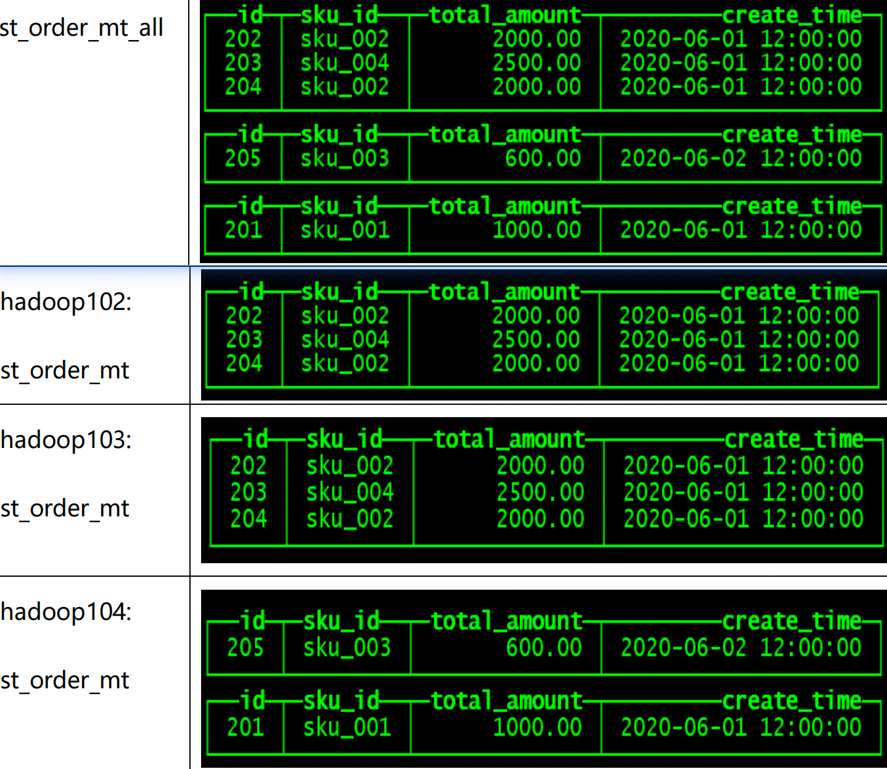</center>


## Explain查看执行计划

在ClickHouse20.6版本之前要查看SQL语句的执行计划需要设置日志级别为trace才能可以看到，并且只能真正执行sql，在执行日志里面查看。在20.6版本引入了原生的执行计划的语法。在20.6.3版本成为正式版本的功能

### 基本语法

```sql
EXPLAIN [AST | SYNTAX | PLAN | PIPELINE | TABLE OVERRIDE]
[setting = value, ...]
[
SELECT ... | tableFunction(...) [COLUMNS (...)]
[ORDER BY ...]
[PARTITION BY ...]
[PRIMARY KEY]
[SAMPLE BY ...]
[TTL ...]
]
[FORMAT ...]
```

1. **PLAN**：用于查看执行计划，**默认值**
   - header：打印计划中各个步骤的head说明，默认关闭，默认值0
   - description：打印计划中各个步骤的描述，默认开启，默认值1
   - actions：打印计划中各个步骤的详细信息，默认关闭，默认值0
   - indexes：显示索引使用情况，默认关闭，默认值0
   - json：是否以 JSON 格式打印执行计划的详细信息，默认关闭，默认值0

2. **AST**：用于查看语法树

3. **SYNTAX**：用于优化语法

4. **PIPELINE**：用于查看PIPELINE计划
   - header打印计划中各个步骤的head说明，默认关闭
   - graph用DOT图形语言描述管道图，默认关闭，需要查看相关的图形需要配合graphviz查看
   - actions如果开启了graph，紧凑打印打，默认开启


### PLAN(默认)

（1）复杂语句

```sql
explain select database,table,count(1) cnt from system.parts where database in ('datasets','system') group by database,table order by database,cnt desc limit 2 by database;
```

```sql
┌─explain───────────────────────────────────────┐
│ Expression (Projection)                       │
│   LimitBy                                     │
│     Expression (Before LIMIT BY)              │
│       Sorting (Sorting for ORDER BY)          │
│         Expression (Before ORDER BY)          │
│           Aggregating                         │
│             Expression (Before GROUP BY)      │
│               Filter (WHERE)                  │
│                 ReadFromStorage (SystemParts) │
└───────────────────────────────────────────────┘
```

> explain类似于递归，执行从最下面开始执行。

（2）打开header和actions的执行计划

```sql
explain header=1, actions=1 select database,table,count(1) cnt from system.parts where database in ('datasets','system') group by database,table order by database,cnt desc limit 2 by database;
```

<center>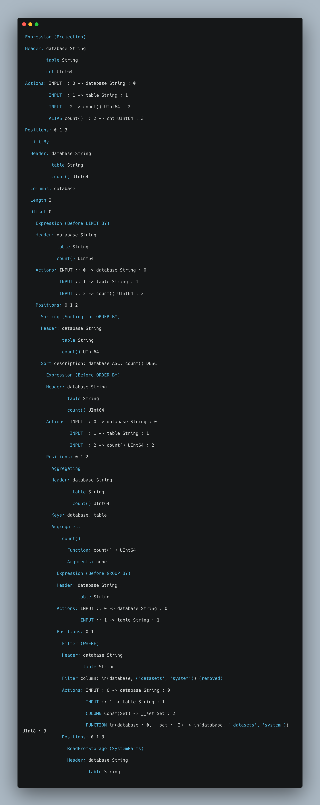</center>


（3）打开json的执行计划

```sql
explain json=1 SELECT number from system.numbers limit 10;
```

```json
 {
    "Plan": {
      "Node Type": "Expression",
      "Description": "(Projection + Before ORDER BY)",
      "Plans": [
        {
          "Node Type": "Limit",
          "Description": "preliminary LIMIT (without OFFSET)",
          "Plans": [
            {
              "Node Type": "ReadFromStorage",
              "Description": "SystemNumbers"
            }
          ]
        }
      ]
    }
  }
```


### AST

```sql
explain ast select number from system.numbers limit 10;
```

```sql
┌─explain─────────────────────────────────────┐
│ SelectWithUnionQuery (children 1)           │
│  ExpressionList (children 1)                │
│   SelectQuery (children 3)                  │
│    ExpressionList (children 1)              │
│     Identifier number                       │
│    TablesInSelectQuery (children 1)         │
│     TablesInSelectQueryElement (children 1) │
│      TableExpression (children 1)           │
│       TableIdentifier system.numbers        │
│    Literal UInt64_10                        │
└─────────────────────────────────────────────┘
```


### SYNTAX

```sql
// 先做一次查询
select number = 1 ? 'hello' : (number = 2 ? 'world' : 'atguigu') from numbers(10);
// 查看语法优化
explain syntax select number = 1 ? 'hello' : (number = 2 ? 'world' : 'atguigu') from numbers(10);
// 开启三元运算符优化
set optimize_if_chain_to_multiif = 1;
// 再次查看语法优化
explain syntax select number = 1 ? 'hello' : (number = 2 ? 'world' : 'atguigu') from numbers(10);
// 返回优化后的语句
select multiIf(number = 1, 'hello', number = 2, 'world', 'atguigu') from numbers(10);
```


### PIPELINE

```sql
explain pipeline select sum(number) from numbers_mt(100000) group by number % 20; 
// 打开其他参数
explain pipeline header=1,graph=1 select sum(number) from numbers_mt(10000) group by number%20;
```

```sql
┌─explain─────────────────┐
│ (Expression)            │
│ ExpressionTransform     │
│   (Aggregating)         │
│   AggregatingTransform  │
│     (Expression)        │
│     ExpressionTransform │
│       (ReadFromStorage) │
│       Limit             │
│         Numbers 0 → 1   │
└─────────────────────────┘
```

```sql
┌─explain─────────────────────────────────────┐
│ digraph                                     │
│ {                                           │
│   rankdir="LR";                             │
│   { node [shape = rect]                     │
│         n2 [label="Limit"];                 │
│         n1 [label="Numbers"];               │
│     subgraph cluster_0 {                    │
│       label ="Expression";                  │
│       style=filled;                         │
│       color=lightgrey;                      │
│       node [style=filled,color=white];      │
│       { rank = same;                        │
│         n5 [label="ExpressionTransform"];   │
│       }                                     │
│     }                                       │
│     subgraph cluster_1 {                    │
│       label ="Aggregating";                 │
│       style=filled;                         │
│       color=lightgrey;                      │
│       node [style=filled,color=white];      │
│       { rank = same;                        │
│         n4 [label="AggregatingTransform"];  │
│       }                                     │
│     }                                       │
│     subgraph cluster_2 {                    │
│       label ="Expression";                  │
│       style=filled;                         │
│       color=lightgrey;                      │
│       node [style=filled,color=white];      │
│       { rank = same;                        │
│         n3 [label="ExpressionTransform"];   │
│       }                                     │
│     }                                       │
│   }                                         │
│   n2 -> n3 [label="                         │
│ number UInt64 UInt64(size = 0)"];           │
│   n1 -> n2 [label="                         │
│ number UInt64 UInt64(size = 0)"];           │
│   n4 -> n5 [label="                         │
│ modulo(number, 20) UInt8 UInt8(size = 0)    │
│ sum(number) UInt64 UInt64(size = 0)"];      │
│   n3 -> n4 [label="                         │
│ number UInt64 UInt64(size = 0)              │
│ modulo(number, 20) UInt8 UInt8(size = 0)"]; │
│ }                                           │
└─────────────────────────────────────────────┘
```


## 建表优化

### 数据类型

#### 时间字段的类型

建表时能用数值型或日期时间型表示的字段就不要用字符串。

虽然ClickHouse底层将DateTime存储为时间戳Long类型，但不建议存储Long类型，因为**DateTime不需要经过函数转换处理，执行效率高、可读性好**。

```sql
create table t_type2(
    id UInt32,
    sku_id String,
    total_amount Decimal(16,2) ,
    create_time Int32 
) engine =ReplacingMergeTree(create_time)
partition by toYYYYMMDD(toDate(create_time)) –-需要转换一次,否则报错
primary key (id)
order by (id, sku_id);
```


#### 空值存储类型
官方已经指出**Nullable**类型几乎总是会拖累性能，因为存储Nullable列时**需要创建一个额外的文件来存储NULL的标记**，并且**Nullable列无法被索引**。因此除非极特殊情况，应**直接使用字段默认值表示空**，或者自行指定一个在业务中无意义的值（例如用-1表示没有商品ID）。

```sql
CREATE TABLE t_null(x Int8, y Nullable(Int8)) ENGINE TinyLog;
INSERT INTO t_null VALUES (1, NULL), (2, 3);
SELECT x + y FROM t_null;
```

<center></center>

单独的文件来存储NULL值：

<center></center>


### 分区和索引
分区粒度根据业务特点决定，不宜过粗或过细。**一般选择按天分区**，也可以指定为**Tuple**()，以单表一亿数据为例，分区大小控制在10-30个为最佳。

必须指定索引列，ClickHouse中的索引列即**排序列**，**通过order by指定**，一般在查询条件中经常被用来充当筛选条件的属性被纳入进来；可以是单一维度，也可以是组合维度的索引；通常需要满足高级列在前、**查询频率大的在前原则**；还有**基数特别大的不适合做索引列**，如用户表的userid字段；通常筛选后的数据满足在百万以内为最佳。


### Index_granularity & TTL

Index_granularity是用来控制索引粒度的，默认是8192，如非必须不建议调整。

如果表中不是必须保留全量历史数据，建议指定TTL（生存时间值），可以免去手动过期历史数据的麻烦，TTL也可以通过alter table语句随时修改。


### 写入和删除优化
1. 尽量不要执行单条或小批量删除和插入操作，这样会产生小分区文件，给后台Merge任务带来巨大压力;
2. 不要一次写入太多分区，或数据写入太快，数据写入太快会导致Merge速度跟不上而报错，一般建议每秒钟发起2-3次写入操作，每次操作写入2w~5w条数据（依服务器性能而定）

写入过快报错，报错信息：

```bash
1. Code: 252, e.displayText() = DB::Exception: Too many parts(304). 
Merges are processing significantly slower than inserts
2. Code: 241, e.displayText() = DB::Exception: Memory limit (for query) 
exceeded:would use 9.37 GiB (attempt to allocate chunk of 301989888 
bytes), maximum: 9.31 GiB
```

处理方式：

- Too many parts处理：使用WAL预写日志，提高写入性能

- in_memory_parts_enable_wal默认为true

在服务器内存充裕的情况下增加内存配额，一般通过max_memory_usage来实现在服务器内存不充裕的情况下，建议将超出部分内容分配到系统硬盘上，但会降低执行速度，一般通过max_bytes_before_external_group_by、max_bytes_before_external_sort参数来实现。


### 常见配置
配置项主要在config.xml或users.xml中，基本上都在**users.xml**里

- config.xml的配置项：[https://clickhouse.tech/docs/en/operations/server-configuration-parameters/settings/](https://clickhouse.tech/docs/en/operations/server-configuration-parameters/settings/)

- users.xml的配置项：[https://clickhouse.tech/docs/en/operations/settings/settings/](https://clickhouse.tech/docs/en/operations/settings/settings/)

影响性能的主要是三种：CPU、内存、IO。

#### CPU资源

|配置	|描述|
|---|---|
|background_pool_size|	后台线程池的大小，merge线程就是在该线程池中执行，该线程池不仅仅是给merge线程用的，默认值16，允许的前提下建议改成cpu个数的2倍（线程数）|
|background_schedule_pool_size	|执行后台任务（复制表、Kafka流、DNS缓存更新）的线程数。默认128，建议改成cpu个数的2倍（线程数）|
|background_distributed_schedule_pool_size|	设置为分布式发送执行后台任务的线程数，默认16，建议改成cpu个数的2倍（线程数）|
|max_concurrent_queries	|最大并发处理的请求数（包含select、insert等），默认值100，推荐150（不够再加）~300|
|max_threads	|设置单个查询所能使用的最大cpu个数，默认是cpu核数|

#### 内存资源
|配置|	描述|
|---|---|
|max_memory_usage|	单次Query占用内存最大值，该值可以设置的比较大，这样可以提升集群查询的上限。保留一点给OS，比如128G内存的机器，设置为100GB|
|max_bytes_before_external_group_by|	一般按照max_memory_usage的一半设置内存，当group使用内存超过阈值后会刷新到磁盘进行。因为ClickHouse聚合分两个阶段：查询并及建立中间数据、合并中间数据，结合上一项，建议50GB|
|max_bytes_before_external_sort	|当order by已使用max_bytes_before_external_sort内存就进行溢写磁盘（基于磁盘排序），如果不设置该值，那么当内存不够时直接抛错，设置了该值order by可以正常完成，但是速度相对存内存来说肯定要慢点（实测慢的非常多，无法接受）|
|max_table_size_to_drop	|应用于需要删除表或分区的情况，默认是50GB，意思是如果删除50GB以上的分区表会失败。建议修改为0，这样不管多大的分区表都可以删除|

#### 存储

ClickHouse不支持设置多数据目录，为了提升数据IO性能，可以挂载虚拟券组，一个券组绑定多块物理磁盘提升读写性能，多数据查询场景SSD会比普通机械硬盘快2-3倍。


## ClickHouse语法优化规则

ClickHouse的SQL优化规则是基于**RBO**（Rule Based Optimization），下面是一些优化规则。

### 准备测试用表

下载hits_v1.tar和visits_v1.tar：

```bash
curl https://clickhouse-datasets.s3.yandex.net/hits/tsv/hits_v1.tsv.xz | unxz --threads=`nproc` > hits_v1.tsv
curl https://clickhouse-datasets.s3.yandex.net/visits/tsv/visits_v1.tsv.xz | unxz --threads=`nproc` > visits_v1.tsv
```

导入数据和定义：

```sql
# now create table：visits_v1
clickhouse-client --query "CREATE DATABASE IF NOT EXISTS datasets"
clickhouse-client --query "CREATE TABLE datasets.visits_v1 ( CounterID UInt32,  StartDate Date,  Sign Int8,  IsNew UInt8,  VisitID UInt64,  UserID UInt64,  StartTime DateTime,  Duration UInt32,  UTCStartTime DateTime,  PageViews Int32,  Hits Int32,  IsBounce UInt8,  Referer String,  StartURL String,  RefererDomain String,  StartURLDomain String,  EndURL String,  LinkURL String,  IsDownload UInt8,  TraficSourceID Int8,  SearchEngineID UInt16,  SearchPhrase String,  AdvEngineID UInt8,  PlaceID Int32,  RefererCategories Array(UInt16),  URLCategories Array(UInt16),  URLRegions Array(UInt32),  RefererRegions Array(UInt32),  IsYandex UInt8,  GoalReachesDepth Int32,  GoalReachesURL Int32,  GoalReachesAny Int32,  SocialSourceNetworkID UInt8,  SocialSourcePage String,  MobilePhoneModel String,  ClientEventTime DateTime,  RegionID UInt32,  ClientIP UInt32,  ClientIP6 FixedString(16),  RemoteIP UInt32,  RemoteIP6 FixedString(16),  IPNetworkID UInt32,  SilverlightVersion3 UInt32,  CodeVersion UInt32,  ResolutionWidth UInt16,  ResolutionHeight UInt16,  UserAgentMajor UInt16,  UserAgentMinor UInt16,  WindowClientWidth UInt16,  WindowClientHeight UInt16,  SilverlightVersion2 UInt8,  SilverlightVersion4 UInt16,  FlashVersion3 UInt16,  FlashVersion4 UInt16,  ClientTimeZone Int16,  OS UInt8,  UserAgent UInt8,  ResolutionDepth UInt8,  FlashMajor UInt8,  FlashMinor UInt8,  NetMajor UInt8,  NetMinor UInt8,  MobilePhone UInt8,  SilverlightVersion1 UInt8,  Age UInt8,  Sex UInt8,  Income UInt8,  JavaEnable UInt8,  CookieEnable UInt8,  JavascriptEnable UInt8,  IsMobile UInt8,  BrowserLanguage UInt16,  BrowserCountry UInt16,  Interests UInt16,  Robotness UInt8,  GeneralInterests Array(UInt16),  Params Array(String),  Goals Nested(ID UInt32, Serial UInt32, EventTime DateTime,  Price Int64,  OrderID String, CurrencyID UInt32),  WatchIDs Array(UInt64),  ParamSumPrice Int64,  ParamCurrency FixedString(3),  ParamCurrencyID UInt16,  ClickLogID UInt64,  ClickEventID Int32,  ClickGoodEvent Int32,  ClickEventTime DateTime,  ClickPriorityID Int32,  ClickPhraseID Int32,  ClickPageID Int32,  ClickPlaceID Int32,  ClickTypeID Int32,  ClickResourceID Int32,  ClickCost UInt32,  ClickClientIP UInt32,  ClickDomainID UInt32,  ClickURL String,  ClickAttempt UInt8,  ClickOrderID UInt32,  ClickBannerID UInt32,  ClickMarketCategoryID UInt32,  ClickMarketPP UInt32,  ClickMarketCategoryName String,  ClickMarketPPName String,  ClickAWAPSCampaignName String,  ClickPageName String,  ClickTargetType UInt16,  ClickTargetPhraseID UInt64,  ClickContextType UInt8,  ClickSelectType Int8,  ClickOptions String,  ClickGroupBannerID Int32,  OpenstatServiceName String,  OpenstatCampaignID String,  OpenstatAdID String,  OpenstatSourceID String,  UTMSource String,  UTMMedium String,  UTMCampaign String,  UTMContent String,  UTMTerm String,  FromTag String,  HasGCLID UInt8,  FirstVisit DateTime,  PredLastVisit Date,  LastVisit Date,  TotalVisits UInt32,  TraficSource    Nested(ID Int8,  SearchEngineID UInt16, AdvEngineID UInt8, PlaceID UInt16, SocialSourceNetworkID UInt8, Domain String, SearchPhrase String, SocialSourcePage String),  Attendance FixedString(16),  CLID UInt32,  YCLID UInt64,  NormalizedRefererHash UInt64,  SearchPhraseHash UInt64,  RefererDomainHash UInt64,  NormalizedStartURLHash UInt64,  StartURLDomainHash UInt64,  NormalizedEndURLHash UInt64,  TopLevelDomain UInt64,  URLScheme UInt64,  OpenstatServiceNameHash UInt64,  OpenstatCampaignIDHash UInt64,  OpenstatAdIDHash UInt64,  OpenstatSourceIDHash UInt64,  UTMSourceHash UInt64,  UTMMediumHash UInt64,  UTMCampaignHash UInt64,  UTMContentHash UInt64,  UTMTermHash UInt64,  FromHash UInt64,  WebVisorEnabled UInt8,  WebVisorActivity UInt32,  ParsedParams    Nested(Key1 String,  Key2 String,  Key3 String,  Key4 String, Key5 String, ValueDouble    Float64),  Market Nested(Type UInt8, GoalID UInt32, OrderID String,  OrderPrice Int64,  PP UInt32,  DirectPlaceID UInt32,  DirectOrderID  UInt32,  DirectBannerID UInt32,  GoodID String, GoodName String, GoodQuantity Int32,  GoodPrice Int64),  IslandID FixedString(16)) ENGINE = CollapsingMergeTree(Sign) PARTITION BY toYYYYMM(StartDate) ORDER BY (CounterID, StartDate, intHash32(UserID), VisitID) SAMPLE BY intHash32(UserID) SETTINGS index_granularity = 8192"
# import data
cat visits_v1.tsv | clickhouse-client   --query "INSERT INTO datasets.visits_v1 FORMAT TSV" --max_insert_block_size=100000
# optionally you can optimize table
clickhouse-client --query "OPTIMIZE TABLE datasets.visits_v1 FINAL"
clickhouse-client --query "SELECT COUNT(*) FROM datasets.visits_v1"
 
 
# now create table：hits_v1
clickhouse-client --query "CREATE DATABASE IF NOT EXISTS datasets"
clickhouse-client --query "CREATE TABLE datasets.hits_v1 ( WatchID UInt64,  JavaEnable UInt8,  Title String,  GoodEvent Int16,  EventTime DateTime,  EventDate Date,  CounterID UInt32,  ClientIP UInt32,  ClientIP6 FixedString(16),  RegionID UInt32,  UserID UInt64,  CounterClass Int8,  OS UInt8,  UserAgent UInt8,  URL String,  Referer String,  URLDomain String,  RefererDomain String,  Refresh UInt8,  IsRobot UInt8,  RefererCategories Array(UInt16),  URLCategories Array(UInt16), URLRegions Array(UInt32),  RefererRegions Array(UInt32),  ResolutionWidth UInt16,  ResolutionHeight UInt16,  ResolutionDepth UInt8,  FlashMajor UInt8, FlashMinor UInt8,  FlashMinor2 String,  NetMajor UInt8,  NetMinor UInt8, UserAgentMajor UInt16,  UserAgentMinor FixedString(2),  CookieEnable UInt8, JavascriptEnable UInt8,  IsMobile UInt8,  MobilePhone UInt8,  MobilePhoneModel String,  Params String,  IPNetworkID UInt32,  TraficSourceID Int8, SearchEngineID UInt16,  SearchPhrase String,  AdvEngineID UInt8,  IsArtifical UInt8,  WindowClientWidth UInt16,  WindowClientHeight UInt16,  ClientTimeZone Int16,  ClientEventTime DateTime,  SilverlightVersion1 UInt8, SilverlightVersion2 UInt8,  SilverlightVersion3 UInt32,  SilverlightVersion4 UInt16,  PageCharset String,  CodeVersion UInt32,  IsLink UInt8,  IsDownload UInt8,  IsNotBounce UInt8,  FUniqID UInt64,  HID UInt32,  IsOldCounter UInt8, IsEvent UInt8,  IsParameter UInt8,  DontCountHits UInt8,  WithHash UInt8, HitColor FixedString(1),  UTCEventTime DateTime,  Age UInt8,  Sex UInt8,  Income UInt8,  Interests UInt16,  Robotness UInt8,  GeneralInterests Array(UInt16), RemoteIP UInt32,  RemoteIP6 FixedString(16),  WindowName Int32,  OpenerName Int32,  HistoryLength Int16,  BrowserLanguage FixedString(2),  BrowserCountry FixedString(2),  SocialNetwork String,  SocialAction String,  HTTPError UInt16, SendTiming Int32,  DNSTiming Int32,  ConnectTiming Int32,  ResponseStartTiming Int32,  ResponseEndTiming Int32,  FetchTiming Int32,  RedirectTiming Int32, DOMInteractiveTiming Int32,  DOMContentLoadedTiming Int32,  DOMCompleteTiming Int32,  LoadEventStartTiming Int32,  LoadEventEndTiming Int32, NSToDOMContentLoadedTiming Int32,  FirstPaintTiming Int32,  RedirectCount Int8, SocialSourceNetworkID UInt8,  SocialSourcePage String,  ParamPrice Int64, ParamOrderID String,  ParamCurrency FixedString(3),  ParamCurrencyID UInt16, GoalsReached Array(UInt32),  OpenstatServiceName String,  OpenstatCampaignID String,  OpenstatAdID String,  OpenstatSourceID String,  UTMSource String, UTMMedium String,  UTMCampaign String,  UTMContent String,  UTMTerm String, FromTag String,  HasGCLID UInt8,  RefererHash UInt64,  URLHash UInt64,  CLID UInt32,  YCLID UInt64,  ShareService String,  ShareURL String,  ShareTitle String,  ParsedParams Nested(Key1 String,  Key2 String, Key3 String, Key4 String, Key5 String,  ValueDouble Float64),  IslandID FixedString(16),  RequestNum UInt32,  RequestTry UInt8) ENGINE = MergeTree() PARTITION BY toYYYYMM(EventDate) ORDER BY (CounterID, EventDate, intHash32(UserID)) SAMPLE BY intHash32(UserID) SETTINGS index_granularity = 8192"
# import data
cat hits_v1.tsv | clickhouse-client --query "INSERT INTO datasets.hits_v1 FORMAT TSV" --max_insert_block_size=100000
# optionally you can optimize table
clickhouse-client --query "OPTIMIZE TABLE datasets.hits_v1 FINAL"
clickhouse-client --query "SELECT COUNT(*) FROM datasets.hits_v1"
```

hits_v1表有130多个字段，880多万条数据

visits_v1表有180多个字段，160多万条数据


### COUNT优化

在调用count函数时，如果使用的是`count()`或者`count(*)`，且没有where条件，则会直接使用system.tables的total_rows（每）：

```sql
explain select count() from datasets.hits_v1;
```

<center>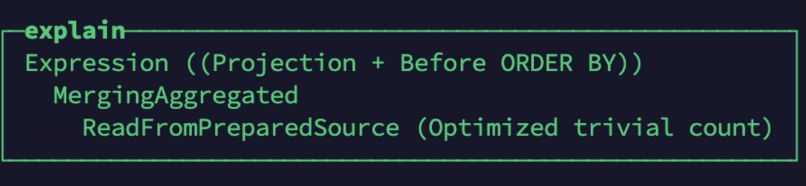</center>

```sql
explain select count(CounterID) from datasets.hits_v1;
```

<center>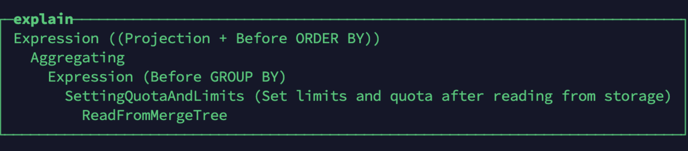</center>


### 消除子查询重复字段

下面语句子查询中有两个重复的id字段，会被去重：

```sql
explain syntax select 
a.UserID,
b.VisitID,
a.URL,
b.UserID
from
datasets.hits_v1 as a 
left join ( 
    select 
    UserID, 
    UserID as HaHa, 
    VisitID 
    from datasets.visits_v1) as b 
using (UserID)
limit 3;
```

优化后的语句：

```sql
SELECT 
UserID,
VisitID,
URL,
b.UserID
FROM datasets.hits_v1 AS a
ALL LEFT JOIN 
(
    SELECT 
    UserID,
    VisitID
    FROM datasets.visits_v1
) AS b USING (UserID)
LIMIT 3;
```


### 谓词下推

谓词下推的基本思想即：**将过滤表达式尽可能移动至靠近数据源的位置，以使真正执行时能直接跳过无关的数据。**

（1）当group by有having子句，但是没有**with cube、with rollup或者with totals**修饰的时候，**having过滤会下推到where提前过滤**。例如下面的查询，having name变成了where name，在group by之前过滤：

```sql
explain syntax select UserID from datasets.hits_v1 group by UserID having UserID = '8585742290196126178';
```

优化后的语句：

```sql
SELECT UserID
FROM datasets.hits_v1
WHERE UserID = '8585742290196126178'
GROUP BY UserID;
```

`WHERE` 在聚合之前执行，而 `HAVING` 之后进行。

（2）子查询也支持谓词下推：

```sql
explain syntax
select *
from 
(
    select UserID
    from datasets.visits_v1
)
where UserID = '8585742290196126178';
```

优化后的语句：

```sql
SELECT UserID
FROM 
(
    SELECT UserID
    FROM datasets.visits_v1
    WHERE UserID = '8585742290196126178' 
)
WHERE UserID = '8585742290196126178';
```


再来一个复杂的例子：

```sql
explain syntax
select * from (
    select * from (
        select UserID from datasets.visits_v1) 
    union all 
    select * from (
        select UserID from datasets.visits_v1)
)
where UserID = '8585742290196126178';
```

优化后的语句：

```sql
SELECT UserID
FROM 
(
    SELECT UserID
    FROM 
    (
        SELECT UserID
        FROM datasets.visits_v1
        WHERE UserID = '8585742290196126178' )
    WHERE UserID = '8585742290196126178'
    UNION ALL
    SELECT UserID
    FROM
    (
        SELECT UserID
        FROM datasets.visits_v1
        WHERE UserID = '8585742290196126178' )
    WHERE UserID = '8585742290196126178' )
WHERE UserID = '8585742290196126178';
```


### 聚合计算外推

聚合函数内的计算会外推

```sql
explain syntax select sum(UserID * 2) from datasets.visits_v1;
```

优化后的语句：

```sql
SELECT sum(UserID) * 2 	FROM datasets.visits_v1;
```


### 聚合函数消除

如果对聚合键，也就是group by key使用min、max、any聚合函数，则将函数消除

```sql
explain syntax select sum(UserID * 2), max(VisitID), max(UserID) from datasets.visits_v1 group by UserID;
```

优化后的语句：

```sql
SELECT sum(UserID) * 2,max(VisitID),UserID FROM datasets.visits_v1 GROUP BY UserID;
```


### 删除重复的order by key

重复的聚合键id字段会被去重：

```sql
explain syntax select * from datasets.visits_v1 order by UserID asc,UserID asc,VisitID asc,VisitID asc;
```

优化后的语句：

```sql
SELECT * FROM datasets.visits_v1 ORDER BY  UserID ASC, VisitID ASC;
```


### 删除重复的limit by key

在ClickHouse里，增加了一个limit by部分，区别于MySQL的limit在最终结果集的行数限制，这个limit by是对by字段，每个值保留对应的行数：

```sql
explain syntax select * from datasets.visits_v1 limit 3 by VisitID,VisitID limit 10;
```

优化后的语句：

```sql
SELECT * FROM datasets.visits_v1 LIMIT 3 BY VisitID LIMIT 10;
```

limit by例子：

```sql
┌─id─┬─name───┬───birthday─┐
│  1 │ First  │ 2011-01-01 │
│  2 │ Second │ 2012-02-02 │
│  3 │ Second │ 2011-01-01 │
└────┴────────┴────────────┘

 select * from t1 limit 1 by birthday;
┌─id─┬─name───┬───birthday─┐
│  1 │ First  │ 2011-01-01 │
│  2 │ Second │ 2012-02-02 │
└────┴────────┴────────────┘
```


### **删除重复的**USING Key

重复的关联键id字段会被去重：

```sql
explain syntax select a.UserID,a.UserID,b.VisitID,a.URL,b.UserID from datasets.hits_v1 as a left join datasets.visits_v1 as b using (UserID, UserID);
```

优化后的语句：

```sql
SELECT UserID,UserID,VisitID,URL,b.UserID FROM datasets.hits_v1 AS a ALL LEFT JOIN datasets.visits_v1 AS b USING (UserID);
```


### 标量替换(with)

```sql
explain syntax
with
(
    select sum(bytes)
    from system.parts
    where active
) as total_disk_usage
select
(sum(bytes) / total_disk_usage) * 100 AS table_disk_usage,table
from system.parts
group by table
order by table_disk_usage desc
limit 10;
```

优化后的语句：

```sql
WITH identity(_CAST(0, 'Nullable(UInt64)')) AS total_disk_usage
SELECT 
(sum(bytes_on_disk AS bytes) / total_disk_usage) * 100 AS table_disk_usage,table
FROM system.parts
GROUP BY table
ORDER BY table_disk_usage DESC
LIMIT 10
```


### 三元运算优化

如果开启了**optimize_if_chain_to_multiif**参数，三元运算符会被替换成multiIf函数：

```sql
explain syntax
select number = 1 ? 'hello' : (number = 2 ? 'world' : 'atguigu') 
from numbers(10) 
settings optimize_if_chain_to_multiif = 1;
```

优化后的语句：

```sql
SELECT multiIf(number = 1, 'hello', number = 2, 'world', 'atguigu')
FROM numbers(10)
SETTINGS optimize_if_chain_to_multiif = 1;
```


## 查询优化
### 单表查询

#### prewhere替代where
prewhere和where语句的作用相同，都是用来过滤数据。**prewhere只支持MergeTree族系列引擎的表，首先会读取指定的列数据，来判断数据过滤，等待数据过滤之后再读取select声明的列字段来补全其余属性**。

当查询列明显多于筛选列时使用prewhere可十倍提升查询性能，prewhere会自动优化执行过滤阶段的数据读取方式，降低IO操作。

在某些场合下，prewhere语句比where语句处理的数据量更少性能更高。

```sql
#关闭where自动转prewhere(默认情况下,where条件会自动优化成prewhere)
set optimize_move_to_prewhere=0;
```

某些场景即使开启优化，也不会自动转换成prewhere，需要手动指定prewhere：

- 使用常量表达式；
- 使用默认值为alias类型的字段；
- 包含了arrayJOIN、globalIn、globalNotIn或者indexHint的查询；
- select查询的列字段和where的谓词相同；
- 使用了主键字段
  

```sql
explain syntax
select WatchID, 
JavaEnable, 
Title, 
GoodEvent, 
EventTime, 
EventDate, 
CounterID, 
ClientIP, 
ClientIP6, 
RegionID, 
UserID, 
CounterClass, 
OS, 
UserAgent, 
URL, 
Referer, 
URLDomain, 
RefererDomain, 
Refresh, 
IsRobot, 
RefererCategories, 
URLCategories, 
URLRegions, 
RefererRegions, 
ResolutionWidth, 
ResolutionHeight, 
ResolutionDepth, 
FlashMajor, 
FlashMinor, 
FlashMinor2
from datasets.hits_v1 where UserID='3198390223272470366';
```

优化后的语句：
```sql
SELECT WatchID, 
JavaEnable, 
Title, 
GoodEvent, 
EventTime, 
EventDate, 
CounterID, 
ClientIP, 
ClientIP6, 
RegionID, 
UserID, 
CounterClass, 
OS, 
UserAgent, 
URL, 
Referer, 
URLDomain, 
RefererDomain, 
Refresh, 
IsRobot, 
RefererCategories, 
URLCategories, 
URLRegions, 
RefererRegions, 
ResolutionWidth, 
ResolutionHeight, 
ResolutionDepth, 
FlashMajor, 
FlashMinor, 
FlashMinor2
FROM datasets.hits_v1 PREWHERE UserID='3198390223272470366';
```


#### 数据采用

```sql
select Title,count(*) as PageViews 
from datasets.hits_v1
sample 0.1
where CounterID =57
group by Title
order by PageViews desc limit 1000;
```

sample 0.1：代表采样10%的数据，也可以是具体的条数。


#### 列裁剪与分区裁剪

数据量太大时应避免使用select * 操作，查询的性能会与查询的字段大小和数量成线性表换，字段越少，消耗的IO资源越少，性能就会越高。


#### order by结合where、limit

千万以上数据集进行order by查询时需要搭配where条件和limit语句一起使用：

```sql
select UserID,Age
from datasets.hits_v1 
where CounterID=57
order by Age desc limit 1000;
```


#### 避免构建虚拟列

如非必须，不要在结果集上构建虚拟列，虚拟列非常消耗资源浪费性能，可以考虑在程序中进行处理，或者在表中构造实际字段进行额外存储

反例：

```sql
select Income,Age,Income/Age as IncRate from datasets.hits_v1;
```

正例：

```sql
select Income,Age from datasets.hits_v1;
```

拿到Income和Age后，考虑在程序中进行处理，或者在表中构造实际字段进行额外存储。


#### uniqCombined替代distinct
性能可提升10倍以上，**uniqCombined底层采用类似HyperLogLog算法实现，能接受2%左右的数据误差，可直接使用这种去重方式提升查询性能**。count(distinct)会使用**uniqExact**精确去重。

不建议在千万级不同数据上执行distinct去重查询，改为近似去重uniqCombined。

反例：

```sql
select count(distinct UserID) from datasets.hits_v1;
```

正例：

```sql
select uniqCombined(UserID) from datasets.hits_v1;
```


#### 使用物化视图

- SQL 的视图：只是把复杂的查询逻辑记录下来的，但是并没有保存对应的数据
- 物化视图：不仅把查询逻辑记录下来，还记录下来数据


#### 其他注意事项
1）查询熔断

为了避免因个别慢查询引起的服务雪崩的问题，除了可以为单个查询设置超时以外，还可以配置周期熔断，在一个查询周期内，如果用户频繁进行慢查询操作超出规定阈值后将无法继续进行查询操作

2）关闭虚拟内存

物理内存和虚拟内存的数据交换，会导致查询变慢，资源允许的情况下关闭虚拟内存

3）配置join_use_nulls

为每一个账户添加join_use_nulls配置，左表中的一条记录在右表中不存在，右表的相应字段会返回该字段相应数据类型的默认值，而不是标准SQL中的Null值

4）批量写入时先排序

批量写入数据时，必须控制每个批次的数据中涉及到的分区的数量，在写入之前最好对需要导入的数据进行排序。无序的数据或者涉及的分区太多，会导致ClickHouse无法及时对新导入的数据进行合并，从而影响查询性能。

5）关注CPU

CPU一般在50%左右会出现查询波动，达到70%会出现大范围的查询超时，CPU是最关键的指标，要非常关注


### 多表关联

#### 准备表和数据

创建小表：

```sql
CREATE TABLE datasets.visits_v2 
ENGINE = CollapsingMergeTree(Sign)
PARTITION BY toYYYYMM(StartDate)
ORDER BY (CounterID, StartDate, intHash32(UserID), VisitID)
SAMPLE BY intHash32(UserID)
SETTINGS index_granularity = 8192
as select * from datasets.visits_v1 limit 10000;
```

创建join结果表，避免控制台疯狂打印数据：

```sql
CREATE TABLE datasets.hits_v2 
ENGINE = MergeTree()
PARTITION BY toYYYYMM(EventDate)
ORDER BY (CounterID, EventDate, intHash32(UserID))
SAMPLE BY intHash32(UserID)
SETTINGS index_granularity = 8192
as select * from datasets.hits_v1 where 1=0;
```


#### 用in代替jion

当多表联查时，查询的数据仅从其中一张表出时，可考虑用IN操作而不是JOIN：

```sql
insert into datasets.hits_v2
select a.* from datasets.hits_v1 a where a. CounterID in 
(select CounterID from datasets.visits_v1);
```

反例：使用join

```sql
insert into table datasets.hits_v2
select a.* from datasets.hits_v1 a left join datasets.visits_v1 b 
on a. CounterID=b. CounterID;
```


#### 大小表join

多表join时要满足**小表在右**的原则，**右表关联时被加载到内存中与左表进行比较**，ClickHouse中无论是Left join、Right join还是Inner join永远都是拿着**右表中的每一条记录到左表中查找该记录是否存在**，所以右表必须是小表。

小表在右：

```sql
insert into table datasets.hits_v2
select a.* from datasets.hits_v1 a left join datasets.visits_v2 b on a. CounterID=b. 
CounterID;
```

反例：大表在右

```sql
insert into table datasets.hits_v2
select a.* from datasets.visits_v2 b left join datasets.hits_v1 a on a. CounterID=b. 
CounterID;
```


#### 注意谓词下推
ClickHouse在join查询时不会主动发起谓词下推的操作，需要每个子查询提前完成过滤操作，需要注意的是，是否执行谓词下推，对性能影响差别很大（新版本中已经不存在此问题，但是需要注意谓词的位置的不同依然有性能的差异）

（1）**having会自动优化为prewhere**

```sql
Explain syntax
select a.* from datasets.hits_v1 a left join datasets.visits_v2 b on a. CounterID=b.CounterID
having a.EventDate = '2014-03-17';
```

优化后的语句：

```sql
SELECT a.* 
FROM datasets.hits_v1 AS a 
ALL LEFT JOIN datasets.visits_v2 AS b ON a.CounterID = b.CounterID 
PREWHERE a.EventDate = '2014-03-17';
```


（2）**尽量在join之前进行过滤**

子查询里where：

```sql
insert into datasets.hits_v2
select a.* from (
    select * from 
    datasets.hits_v1 
    where EventDate = '2014-03-17'
) a left join datasets.visits_v2 b on a. CounterID=b. CounterID;
```

反例：

```sql
insert into datasets.hits_v2
select a.* from datasets.hits_v1 a left join datasets.visits_v2 b on a. CounterID=b.CounterID
where a.EventDate = '2014-03-17';
```


####  分布式表使用 GLOBAL
两张分布式表上的 IN 和 JOIN 之前必须加上 **GLOBAL** 关键字，右表只会在接收查询请求的那个节点查询一次，并将其分发到其他节点上。如果不加 GLOBAL 关键字的话，每个节点都会单独发起一次对右表的查询，而右表又是分布式表，就导致右表一共会被查询 N²次（N是该分布式表的分片数量），这就是查询放大，会带来很大开销。

- 当使用正常 `JOIN`，将查询发送到远程服务器。 为了创建正确的表，在每个子查询上运行子查询，并使用此表执行联接。 换句话说，在每个服务器上单独形成右表。
- 使用时 `GLOBAL ... JOIN`，首先请求者服务器运行一个子查询来计算正确的表。 此临时表将传递到每个远程服务器，并使用传输的临时数据对其运行查询。


#### 使用字典表

将一些需要关联分析的业务创建成字典表进行 join 操作，前提是字典表不宜太大，因为字典表会常驻内存。

创建：

```sql
create table t_region(region_id UInt64, parent_region UInt64, region_name String) ENGINE=TinyLog;
insert into t_region values(1, 0, 'jiangsu'),(2, 1, 'suzhou'),(3, 2, 'huqiu'),(4, 0, 'anhui'),(5, 4, 'hefei');

# 创建字典， 指定HIERARCHICAL字段：
DROP DICTIONARY t_dict_region;
CREATE DICTIONARY t_dict_region (
    region_id UInt64,
    parent_region UInt64  HIERARCHICAL,
    region_name String 
)
PRIMARY KEY region_id
SOURCE(CLICKHOUSE(
    host 'localhost'
    port 9001
    user 'default'
    db 'default'
    password ''
    table 't_region'
))
LAYOUT(HASHED())
LIFETIME(30);
```

查询：

```sql
SELECT dictGetString('default.t_dict_region', 'region_name', toUInt64(2)) AS regionName;
┌─regionName─┐
│ suzhou     │
└────────────┘
```


#### 多表查询小结

- Join 原理：先把右表加载到内存，再去一一匹配左表
- 非必要不使用 Join，可以考虑in
- 若不得不使用到 Join，优化方式：
  - 将小表放右边
  - 能过滤的先过滤，特别是针对右表
  - 特殊场景可以考虑使用字典表


## 数据一致性

在clickhouse中，即便对数据一致性支持最好的 Mergetree，也只是`保证最终一致性`：

<center>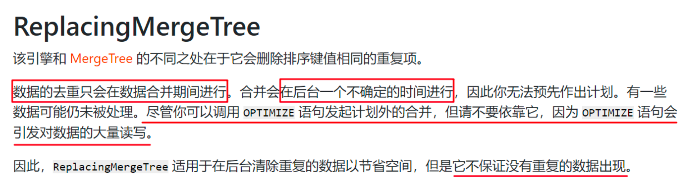</center>

我们在使用 ReplacingMergeTree、SummingMergeTree 这类表引擎的时候，会出现短暂数据不一致的情况。在某些对一致性非常敏感的场景，通常有以下几种解决方案。


### 准备测试表和数据

创建表：

```sql
CREATE TABLE test_a(
	user_id UInt64,
	score String,
	deleted UInt8 DEFAULT 0,
	create_time DateTime DEFAULT toDateTime(0)
)ENGINE= ReplacingMergeTree(create_time)
ORDER BY user_id;
```

- user_id 是数据去重更新的标识;
- create_time 是版本号字段，每组数据中 create_time 最大的一行表示最新的数据;
- deleted 是逻辑删除标记位，比如 0 代表未删除，1 代表删除数据。

写入 1000 万 测试数据：

```sql
INSERT INTO TABLE test_a(user_id,score)
WITH(
	SELECT ['A','B','C','D','E','F','G']
)AS dict
SELECT number AS user_id, dict[number%7+1] FROM numbers(10000000);
```

修改前 50 万 行数据，修改内容包括 name 字段和 create_time 版本号字段：

```sql
INSERT INTO TABLE test_a(user_id,score,create_time)
WITH(
    SELECT ['AA','BB','CC','DD','EE','FF','GG']
)AS dict
SELECT number AS user_id, dict[number%7+1], now() AS create_time FROM 
numbers(500000);
```

统计总数：

```sql
SELECT COUNT() FROM test_a;
10500000
```

还未触发分区合并，所以还未去重。


### 手动 OPTIMIZE(不推荐)

在写入数据后，立刻执行 OPTIMIZE 强制触发新写入分区的合并动作。

```sql
OPTIMIZE TABLE test_a FINAL;

语法：OPTIMIZE TABLE [db.]name [ON CLUSTER cluster] [PARTITION partition | 
PARTITION ID 'partition_id'] [FINAL] [DEDUPLICATE [BY expression]]
```


### 通过 Group by 去重

执行去重的查询：

```sql
SELECT
user_id ,
argMax(score, create_time) AS score, 
argMax(deleted, create_time) AS deleted,
max(create_time) AS ctime 
FROM test_a 
GROUP BY user_id
HAVING deleted = 0;
```

- argMax(field1，field2):取 field2 最大值所在行的 field1 字段值

当我们更新数据时，会写入一行新的数据，例如上面语句中，通过查询最大的create_time 得到修改后的 score 字段值。


创建视图，方便查询：

```sql
CREATE VIEW view_test_a AS
SELECT
user_id ,
argMax(score, create_time) AS score, 
argMax(deleted, create_time) AS deleted,
max(create_time) AS ctime 
FROM test_a 
GROUP BY user_id
HAVING deleted = 0;
```

插入重复数据，再次查询：

```sql
#再次插入一条数据
INSERT INTO TABLE test_a(user_id,score,create_time)
VALUES(0,'AAAA',now())
#再次查询
SELECT *
FROM view_test_a
WHERE user_id = 0;
```

删除数据测试：

```sql
#再次插入一条标记为删除的数据
INSERT INTO TABLE test_a(user_id,score,deleted,create_time) 
VALUES(0,'AAAA',1,now());

#再次查询，刚才那条数据看不到了
SELECT *
FROM view_test_a
WHERE user_id = 0;
```

这行数据并没有被真正的删除，而是被过滤掉了。在一些合适的场景下，可以结合表级别的 TTL 最终将物理数据删除。


### 通过 FINAL 查询
**在查询语句后增加 FINAL 修饰符，这样在查询的过程中将会执行 Merge 的特殊逻辑**（例如数据去重，预聚合等）。

但是这种方法在早期版本基本没有人使用，因为在增加 FINAL 之后，我们的查询将会变成一个单线程的执行过程，查询速度非常慢。

在 v20.5.2.7-stable 版本中，FINAL 查询支持多线程执行，并且可以通过 max_final_threads 参数控制单个查询的线程数。但是目前读取 part 部分的动作依然是串行的。FINAL 查询最终的性能和很多因素相关，列字段的大小、分区的数量等等都会影响到最终的查询时间，所以还要结合实际场景取舍。

参考链接：https://github.com/ClickHouse/ClickHouse/pull/10463

#### 老版本测试

普通查询语句：

```sql
select * from visits_v1 WHERE StartDate = '2014-03-17' limit 100;
```


FINAL 查询：

```sql
select * from visits_v1 FINAL WHERE StartDate = '2014-03-17' limit 100;
```

先前的并行查询变成了单线程。


#### 新版本测试

普通语句查询：

```sql
select * from visits_v1 WHERE StartDate = '2014-03-17' limit 100 settings max_threads = 2;
```

查看执行计划：

```sql
explain pipeline select * from visits_v1 WHERE StartDate = '2014-03-17' limit 100 settings max_threads = 2;

(Expression) 
	ExpressionTransform × 2
	(SettingQuotaAndLimits) 
		(Limit) 
		Limit 2 → 2
			(ReadFromMergeTree) 
			MergeTreeThread × 2 0 → 1
```

明显将由 2 个线程并行读取 part 查询。


FINAL 查询：

```sql
select * from visits_v1 final WHERE StartDate = '2014-03-17' limit 100 
settings max_final_threads = 2;
```

查询速度没有普通的查询快，但是相比之前已经有了一些提升,查看 FINAL 查询的执行计划：

```sql
explain pipeline select * from visits_v1 final WHERE StartDate = '2014-03-17' limit 100 settings max_final_threads = 2;

(Expression) 
ExpressionTransform × 2 
(SettingQuotaAndLimits) 
	(Limit) 
	Limit 2 → 2 
		(ReadFromMergeTree) 
		ExpressionTransform × 2 
			CollapsingSortedTransform × 2
				Copy 1 → 2 
					AddingSelector 
						ExpressionTransform
							MergeTree 0 → 1 
```

从 CollapsingSortedTransform 这一步开始已经是多线程执行，但是读取 part 部分的动作还是串行。


## 物化视图

### 基本概念

ClickHouse 的**物化视图是一种查询结果的持久化**，它确实是给我们带来了查询效率的提升。用户查起来跟表没有区别，它就是一张表，它也像是一张时刻在预计算的表，创建的过程它是用了一个特殊引擎，加上后来 as select，就是 create 一个 table as select 的写法。

“查询结果集”的范围很宽泛，可以是基础表中部分数据的一份简单拷贝，也可以是多表 join 之后产生的结果或其子集，或者原始数据的聚合指标等等。所以，**物化视图不会随着基础表的变化而变化，所以它也称为快照**（snapshot）。


### 物化视图 vs 普通视图

- `普通视图不保存数据，保存的仅仅是查询语句`，查询的时候还是从原表读取数据，可以将普通视图理解为是个子查询。
- `物化视图则是把查询的结果根据相应的引擎存入到了磁盘或内存中`，对数据重新进行了组织，你可以理解物化视图是完全的一张新表。


### 优缺点

- 优点：查询速度快，要是把物化视图这些规则全部写好，它比原数据查询快了很多，总的行数少了，因为都预计算好了。
- 缺点：它的本质是一个流式数据的使用场景，是累加式的技术，所以要用历史数据做去重、去核这样的分析，在物化视图里面是不太好用的。在某些场景的使用也是有限的。而且如果一张表加了好多物化视图，在写这张表的时候，就会消耗很多机器的资源，比如数据带宽占满、存储一下子增加了很多。


### 基本语法

也是 create 语法，会创建一个隐藏的目标表来保存视图数据。也可以 TO 表名，保存到一张显式的表。没有加 TO 表名，默认为 `.inner.{原表的表名}`。

```sql
CREATE [MATERIALIZED] VIEW [IF NOT EXISTS] [db.]table_name [TO[db.]name]  [ENGINE = engine] [POPULATE] AS SELECT ...
```

1. 创建物化视图的限制：

   - **必须指定物化视图的 engine 用于数据存储**；
   - TO [db].[table]语法的时候，不得使用 POPULATE；
   - 查询语句(select）可以包含下面的子句： DISTINCT, GROUP BY, ORDER BY, LIMIT…；
   - 物化视图的 alter 操作有些限制，操作起来不大方便；
   - 若物化视图的定义使用了 TO [db.]name 子语句，则可以将目标表的视图 卸载 DETACH 再装载 ATTACH。

2. 物化视图的数据更新：

   1. 物化视图创建好之后，若源表被写入新数据则物化视图也会同步更新；

   2. POPULATE 关键字决定了物化视图的更新策略：

      - 若有 POPULATE 则在创建视图的过程会将源表已经存在的数据一并导入，类似于 create table … as；
      - 若无POPULATE 则物化视图在创建之后没有数据，只会在创建只有同步之后写入 源表的数据

      clickhouse 官方并不推荐使用POPULATE，因为**在创建物化视图的过程中同时写入的数据不能被插入物化视图**。

3. 物化视图不支持同步删除，若源表的数据不存在（删除了）则物化视图的数据仍然保留；

4. 物化视图是一种特殊的数据表，可以用 show tables 查看；


### 案例实操

对于一些确定的数据模型，可将统计指标通过物化视图的方式进行构建，这样可避免查询时重复计算的过程，物化视图会在有新数据插入时进行更新。

#### 准备测试用表和数据

建表：

```sql
#建表语句
CREATE TABLE hits_test
(
	EventDate Date, 
	CounterID UInt32, 
	UserID UInt64, 
	URL String, 
	Income UInt8
)
ENGINE = MergeTree()
PARTITION BY toYYYYMM(EventDate)
ORDER BY (CounterID, EventDate, intHash32(UserID))
SAMPLE BY intHash32(UserID)
SETTINGS index_granularity = 8192
```

插入：

```sql
INSERT INTO hits_test
SELECT 
	EventDate,
	CounterID,
	UserID,
	URL,
	Income 
FROM hits_v1 
limit 10000;
```


#### 创建物化视图

```sql
#建表语句
CREATE MATERIALIZED VIEW hits_mv 
ENGINE=SummingMergeTree
PARTITION BY toYYYYMM(EventDate) ORDER BY (EventDate, intHash32(UserID)) 
AS SELECT
UserID,
EventDate,
count(URL) as ClickCount,
sum(Income) AS IncomeSum
FROM hits_test
WHERE EventDate >= '2014-03-20' #设置更新点,该时间点之前的数据可以另外通过
								#insert into select …… 的方式进行插入
GROUP BY UserID,EventDate;

# 或者可以用下列语法，表 A 可以是一张 mergetree 表
CREATE MATERIALIZED VIEW 物化视图名 TO 表 A AS SELECT FROM 表 B;

#不建议添加 populate 关键字进行全量更新				
```


#### 导入增量数据

```sql
#导入增量数据
INSERT INTO hits_test 
SELECT 
	EventDate,
	CounterID,
	UserID,
	URL,
	Income 
FROM hits_v1 
WHERE EventDate >= '2014-03-23' 
limit 10;

#查询物化视图
SELECT * FROM hits_mv;
```


#### 导入历史数据

```sql
#导入增量数据
INSERT INTO hits_mv
SELECT
	UserID,
	EventDate,
	count(URL) as ClickCount,
	sum(Income) AS IncomeSum
FROM hits_test
WHERE EventDate = '2014-03-20'
GROUP BY UserID,EventDate
#查询物化视图
SELECT * FROM hits_mv;
```


## 常见问题排查

### 分布式DDL 某数据节点的副本不执行

问题：使用分布式 ddl 执行命令 create table on cluster xxxx 某个节点上没有创建表，但是 client 返回正常，查看日志有如下报错。

```sql
<Error> xxx.xxx: Retrying createReplica(), because some other replicas were created at the same time
```

解决办法：重启该不执行的节点。


### 数据副本表和数据不一致
问题：由于某个数据节点副本异常，导致两数据副本表不一致，某个数据副本缺少表，需要将两个数据副本调整一致。

解决办法：在缺少表的数据副本节点上创建缺少的表，创建为本地表，表结构可以在其他数据副本通过 show crete table xxxx 获取。
表结构创建后，clickhouse 会自动从其他副本同步该表数据，验证数据量是否一致即可。


### 副本节点全量恢复
问题：某个数据副本异常无法启动，需要重新搭建副本。

解决办法：

- 清空异常副本节点的 metadata 和 data 目录；
- 从另一个正常副本将 metadata 目录拷贝过来（这一步之后可以启动数据库，但是只有表结构没有数据）；
- 执行 sudo -u clickhouse touch /data/clickhouse/flags/force_restore_data；
- 启动数据库。


### 数据副本启动缺少 zk 表

问题：某个数据副本表在 zk 上丢失数据，或者不存在，但是 metadata 元数据里存在，导致启动异常，报错：

```sql
Can’t get data for node /clickhouse/tables/01-02/xxxxx/xxxxxxx/replicas/xxx/metadata: node doesn’t exist (No node): 
Cannot attach table xxxxxxx
```

解决办法：

- metadata 中移除该表的结构文件，如果多个表报错都移除
- mv metadata/xxxxxx/xxxxxxxx.sql /tmp/
- 启动数据库
- 手工创建缺少的表，表结构从其他节点 show create table 获取。
- 创建后会自动同步数据，验证数据是否一致。


### ZK table replicas 数据未删除，导致重建表报错
问题：重建表过程中，先使用 drop table xxx on cluster xxx ,各节点在 clickhouse 上table 已物理删除，但是 zk 里面针对某个 clickhouse 节点的 table meta 信息未被删除（低概率事件），因 zk 里仍存在该表的 meta 信息，导致再次创建该表 create table xxx on cluster, 该节点无法创建表(其他节点创建表成功)，报错：
```sql
Replica /clickhouse/tables/01-03/xxxxxx/xxx/replicas/xxx already exists..
```

解决办法：

- 从其他数据副本 cp 该 table 的 metadata sql 过来.
- 重启节点。


### Clickhouse 节点意外关闭

问题：模拟其中一个节点意外宕机，在大量 insert 数据的情况下，关闭某个节点。

现象：数据写入不受影响、数据查询不受影响、建表 DDL 执行到异常节点会卡住，报错：

```sql
Code: 159. DB::Exception: Received from localhost:9000. DB::Exception: Watching task /clickhouse/task_queue/ddl/query-0000565925 is executing longer than distributed_ddl_task_timeout (=180) seconds. There are 1 unfinished hosts (0 of them are currently active), they are going to execute the query in background.
```

解决办法：启动异常节点，期间其他副本写入数据会自动同步过来，其他副本的建表 DDL 也会同步。


### 其他问题参考

阿里云帮助中心：https://help.aliyun.com/document_detail/162815.html?spm=a2c4g.11186623.6.652.312e79bd17U8IO


## 监控

### 监控概述

ClickHouse 运行时会将一些个自身的运行状态记录到众多系统表中( system.*)。所以我们对于 CH 自身的一些运行指标的监控数据，也主要来自这些系统表。

但是直接查询这些系统表会有一些不足之处：

- 这种方式太过底层，不够直观，我们还需要在此之上实现可视化展示；
- 系统表只记录了 CH 自己的运行指标，有些时候我们需要外部系统的指标进行关联分析，例如 ZooKeeper、服务器 CPU、IO 等等。

现在 Prometheus + Grafana 的组合比较流行，安装简单易上手，可以集成很多框架，包括服务器的负载, 其中 Prometheus 负责收集各类系统的运行指标; Grafana 负责可视化的部分。

ClickHouse 从 v20.1.2.4 开始，内置了对接 Prometheus 的功能，配置的方式也很简单,可以将其作为 Prometheus 的 Endpoint 服务，从而自动的将 metrics 、 events 和asynchronous_metrics 三张系统的表的数据发送给 Prometheus。


### 修改配置文件

```xml
vim /etc/clickhouse-server/config.xml
<prometheus>
    <endpoint>/metrics</endpoint>
    <port>9363</port>
    <metrics>true</metrics>   
    <events>true</events>
    <asynchronous_metrics>true</asynchronous_metrics>
    <status_info>true</status_info>
</prometheus>
```

如果有多个 CH 节点，分发配置。

重启CK。

浏览器打开: http://wdc_api1:9363/metrics

看到信息说明 ClickHouse 开启 Metrics 服务成功。

<center>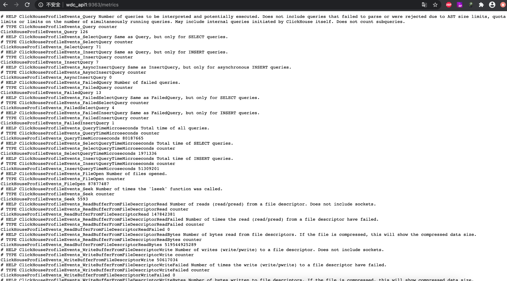</center>

可在此处找模板，拿着模板ID直接拷贝到grafana中即可

https://grafana.com/grafana/dashboards/

可用14432这个模板：

<center>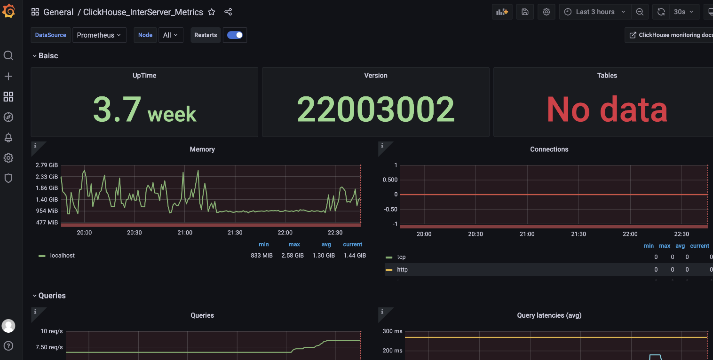</center>


## 手动实现备份及恢复

ClickHouse 允许使用 ALTER TABLE ... FREEZE PARTITION ... 查询以创建表分区的本地副本。这是利用硬链接(hardlink)到/var/lib/clickhouse/shadow/ 文件夹中实现的，所以它通常不会因为旧数据而占用额外的磁盘空间。 创建的文件副本不由ClickHouse 服务器处理，所以不需要任何额外的外部系统就有一个简单的备份。防止硬件问题，最好将它们远程复制到另一个位置，然后删除本地副本。

### 创建备份路径

创建用于存放备份数据的目录 shadow

```bash
sudo mkdir -p /var/lib/clickhouse/shadow/
chown clickhouse:clickhouse /var/lib/clickhouse/shadow/
```

如果目录存在，先清空目录下的数据。

### 执行备份指令

```sql
echo -n 'alter table t_order_rmt freeze' | clickhouse-client --password
```

### 将备份数据保存到其他路径

```bash
#创建备份存储路径
sudo mkdir -p /var/lib/clickhouse/backup/
#拷贝数据到备份路径
sudo cp -r /var/lib/clickhouse/shadow/ /var/lib/clickhouse/backup/my-backup-name
#为下次备份准备，删除 shadow 下的数据
sudo rm -rf /var/lib/clickhouse/shadow/*
```


### 恢复数据

（1）模拟删除备份过的表

```bash
echo ' drop table t_order_rmt ' | clickhouse-client --password
```

（2）重新创建表

```sql
CREATE TABLE default.t_order_rmt
(
    `id` UInt32,
    `sku_id` String,
    `total_amount` Decimal(16, 2),
    `create_time` DateTime
)
ENGINE = ReplacingMergeTree(create_time)
PARTITION BY toYYYYMMDD(create_time)
PRIMARY KEY id
ORDER BY (id, sku_id)
SETTINGS index_granularity = 8192;
```

（3）将备份复制到 detached 目录

```bash
sudo cp -rl  backup/my-backup-name/1/store/6c4/6c493710-ae3e-4847-a0e2-e98132de3f40/* data/default/t_order_rmt/detached/
```

ClickHouse 使用文件系统硬链接来实现即时备份，而不会导致ClickHouse 服务停机（或锁定）。这些硬链接可以进一步用于有效的备份存储。在支持硬链接的文件系统（例如本地文件系统或NFS）上，将 cp 与-l 标志一起使用（或将 rsync 与–hard-links 和–numeric-ids 标志一起使用）以避免复制数据。

（4）执行 attach

```bash
echo 'alter table t_order_rmt attach partition 20200601'| clickhouse-client --password
```

（5）查看数据

```bash
echo 'select count() from t_order_rmt' | clickhouse-client --password
Password for user (default):
3
```

 


